NS cod example
================

## Background

This document illustrates the generation of a stochastic operating model
(OM) for North Sea cod which is then used for a projection to find MSY.

The basis is the North Sea cod SAM model from ICES WGNSSK 2018 which was
used at ICES WKNSMSE.

The code is based on
<https://github.com/ices-taf/WK_WKNSMSE_cod.27.47d20> and
<https://github.com/shfischer/ICES_MSE_course_2021>.

## Load R packages

``` r
library(stockassessment)
library(doParallel)
library(FLCore)
library(FLash)
library(ggplotFL)
library(FLfse)
```

## Simulation (projection) specification

First we define the dimensions for the projection, i.e. the number of
simulation replicates (called iterations in FLR) and the number of
projected years.

``` r
### number of simulation iterations/replicates
n <- 1000
### number of years for projection
n_years <- 20 - 1 ### -1 because cod includes some intermediate year values
```

## Recreating the WGNSSK 2018 stock assessment

We recreate the SAM stock assessment from 2018 so that we can base the
OM on that. The input data for North Sea cod is ncluded the `FLfse`
package.

-   `cod4_stk.rds`: An `FLStock` object, with biological and fishery
    data
-   `cod4_idx.rds`: An `FLIndices` object with the two survey indices
    (IBTS Q1 and Q3)
-   `cod4_conf_sam.rds`: The SAM model configuration

``` r
data("cod4_stk")
data("cod4_idx")
data("cod4_conf_sam")
```

We can now replicate the SAM model fit:

``` r
### fit SAM to cod
fit <- FLR_SAM(stk = cod4_stk, idx = cod4_idx, conf = cod4_conf_sam)
### the output is a normal SAM object
fit
```

    ## SAM model: log likelihood is -169.7853 Convergence OK

``` r
tail(summary(fit))
```

    ##      R(age 1)    Low   High    SSB   Low   High Fbar(2-4)   Low  High
    ## 2013   226194 173181 295435  99494 81167 121960     0.442 0.375 0.521
    ## 2014   317568 242921 415153 105714 86598 129050     0.445 0.380 0.520
    ## 2015   155316 118799 203058 119893 97172 147926     0.433 0.371 0.506
    ## 2016   109912  82134 147083 119699 97197 147411     0.423 0.359 0.498
    ## 2017   385593 259272 573460 113502 90267 142718     0.444 0.373 0.528
    ## 2018    97383  40347 235049 118387 90333 155154     0.446 0.353 0.563

``` r
plot(fit)
```

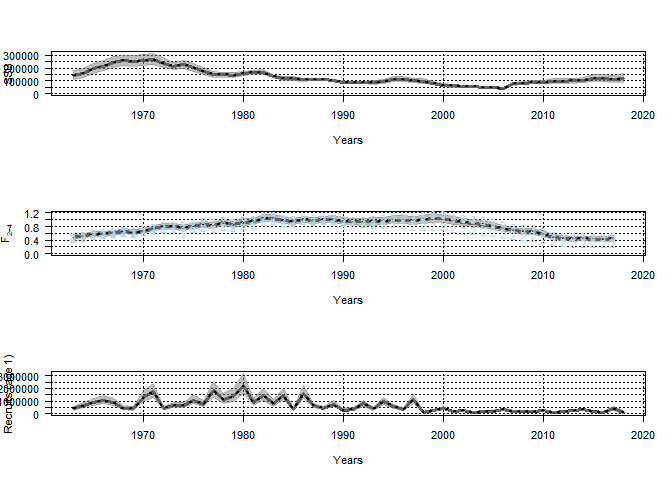<!-- -->

Now we need to convert the results into an FLR object. The main data for
the OM will be stored in an `FLStock`:

``` r
### convert SAM model fit into FLStock
stk <- SAM2FLStock(object = fit, stk = cod4_stk, correct_catch = TRUE)
### correct_catch applies the catch scaling applied to cod in 2018
### this is no used for other stocks
### set units
units(stk)[1:17] <- as.list(c(rep(c("t", "1000", "kg"), 4),
                              "", "", "f", "", ""))
plot(stk)
```

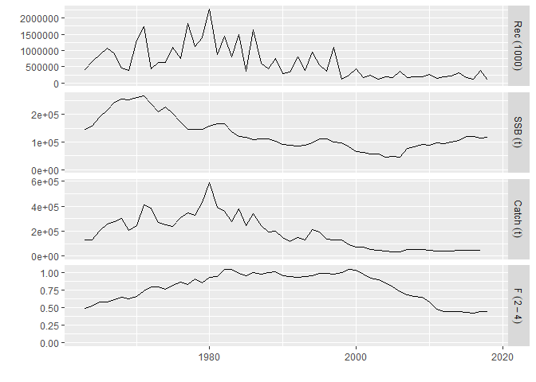<!-- -->

``` r
### save for later comparison
stk_orig <- stk
```

## Add uncertainty

So far, the FLStock `stk` contains only one replicate - the point
estimate (median) from SAM. However, we want to include the uncertainty
estimated by SAM and will use SAM’s variance-covariance matrix to
quantify uncertainty.

``` r
### add iteration dimension
stk <- FLCore::propagate(stk, n)
dim(stk)
```

    ## [1]    6   56    1    1    1 1000

The `FLfse` package contains the function `SAM_uncertainty()` which
returns uncertainty estimates from SAM. The source code for this
functions is available on
[GitHub](https://github.com/shfischer/FLfse/blob/64cec8ee86c9309a5b4e84ff1790d0ed594bc7ee/FLfse/R/sam.R#L1181-L1524).
See also the help file `?SAM_uncertainty` for details.

``` r
### set random number seed to ensure reproducibility
set.seed(1)
### estimate uncertainty
### SAM_uncertainty() is defined
uncertainty <- SAM_uncertainty(fit = fit, n = n, print_screen = FALSE, 
                               idx_cov = TRUE, catch_est = TRUE)
```

Now we can add the noise to the stock

``` r
### add noise to stock numbers
stock.n(stk)[] <- uncertainty$stock.n
stock(stk)[] <- computeStock(stk) ### update total stock
### add noise to F
harvest(stk)[] <- uncertainty$harvest
### add noise to catch numbers
catch.n(stk)[, dimnames(stk)$year[-dims(stk)$year]] <- uncertainty$catch.n
catch(stk) <- computeCatch(stk)
### plot stock and confidence intervals
plot(stk, probs = c(0.05, 0.25, 0.5, 0.75, 0.95))
```

<!-- -->

## Extend stock for projection

Now it is time to extend our `FLStock` for the projection:

``` r
stk_stf <- stf(stk, nyears = n_years)
```

### Introduce variability

`FLash`’s `stf()` uses a three-year average for unknown metrics, such as
weights at age or maturity and this is kept constant for all projection
years. However, we want to introduce variability.

In the absence of known functional relationships for biological data, we
will simply resample from historical data. This creates some variability
but without any trends. We will use the last five data years
(2013-2017).

Because we used the ICES WGNSSK 2018 stock assessment, 2018 is an
intermediate year and there is no data (such as catch) available for
this year. The 2018 values in `stk` are simply averages of previous
years. Consequently, we will overwrite these values for the MSE.

``` r
### use last five data years (2013-2017) to sample biological parameters
sample_yrs <- 2013:2017
### get year position of sample years
sample_yrs_pos <- which(dimnames(stk_stf)$year %in% sample_yrs)
sample_yrs_pos
```

    ## [1] 51 52 53 54 55

``` r
set.seed(2) ### set random number seed
### resample historical years
### n_years + 1: projection years plus 2018
### * n: independently for each replicate
bio_samples <- sample(x = sample_yrs_pos, 
                      size = (n_years + 1) * n, replace = TRUE)
table(bio_samples)
```

    ## bio_samples
    ##   51   52   53   54   55 
    ## 3950 3950 4101 4034 3965

Then, we can insert the data from the selected years.

``` r
### years to be populated
bio_yrs <- which(dimnames(stk_stf)$year %in% 2018:dims(stk_stf)$maxyear)
### insert values
### the historical biological parameters are identical for all replicates
### and consequently do not need to be treated individually
### (but keep age structure), so we can use replicate 1 to get the data
catch.wt(stk_stf)[, bio_yrs] <- c(catch.wt(stk)[, bio_samples,,,, 1])
stock.wt(stk_stf)[, bio_yrs] <- c(stock.wt(stk)[, bio_samples,,,, 1])
landings.wt(stk_stf)[, bio_yrs] <- c(landings.wt(stk)[, bio_samples,,,, 1])
discards.wt(stk_stf)[, bio_yrs] <- c(discards.wt(stk)[, bio_samples,,,, 1])
m(stk_stf)[, bio_yrs] <- c(m(stk)[, bio_samples,,,, 1])
mat(stk_stf)[, bio_yrs] <- c(mat(stk)[, bio_samples,,,, 1])
### maturity data for 2018 exists, re-insert real data
mat(stk_stf)[, ac(2018)] <- mat(stk_orig)[, ac(2018)]
plot(window(mat(stk_stf), start = 2000))
```

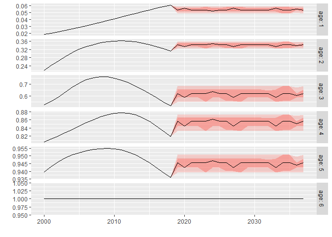<!-- -->

Now we can do the same for the selectivity:

``` r
set.seed(3)
### do the same for selectivity
sel_samples <- sample(x = sample_yrs_pos, 
                      size = (n_years + 1) * n, replace = TRUE)
### selectivity differs by replicate -> keep replicate specific values
sel_samples_iter <- split(sel_samples, 
                          f = rep(seq(n), each = n_years + 1))
sel_vals <- as.numeric(sapply(seq(n), function(x) {
  c(harvest(stk)[, sel_samples_iter[[x]],,,, x])
}))
### insert
harvest(stk_stf)[, bio_yrs] <- sel_vals
```

In the projection, we only consider the total catch and do not
distinguish between landings and discards. However, the total catch is
automatically split into discards and landings based on an historical
average. Catch data for 2018 is missing but we can make the same
assumption as in the following projection years.

``` r
landings.n(stk_stf)[, ac(2018)] <- landings.n(stk_stf)[, ac(2019)]
discards.n(stk_stf)[, ac(2018)] <- discards.n(stk_stf)[, ac(2019)]
```

## Recruitment

If we want to project into the future, we will need to define a
stock-recruitment function. There is no clear relationship visible
between SSB and recruitment for cod. Also, absolute levels have changed
over time (gadoid outburst in the past, currently low SSB and
recruitment):

``` r
srplot(fit)
```

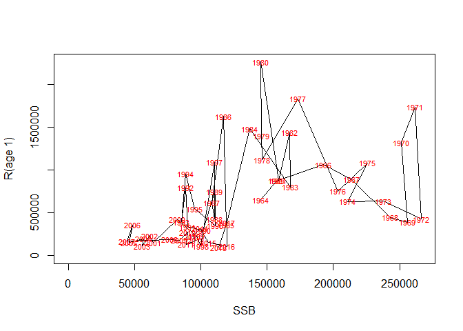<!-- -->

### Recruitment model

Consequently, we use the simplest recruitment model which includes
density dependence: a segmented regression (or hockey stick model).
Also, we restrict the model to the recent past to account for the
current low values.

``` r
### create FLSR to store recruitment model
sr <- as.FLSR(window(stk_stf, start = 1997), model = "segreg")
### fit model individually to each replicate
sr <- fmle(sr, control = list(trace = 0)) # trace = 0 turns off console output
plot(sr) ### all replicates
```

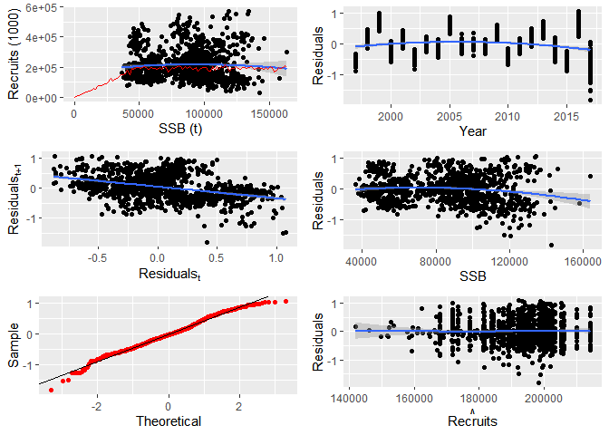<!-- -->

``` r
plot(iter(sr, 1)) ### first replicate only
```

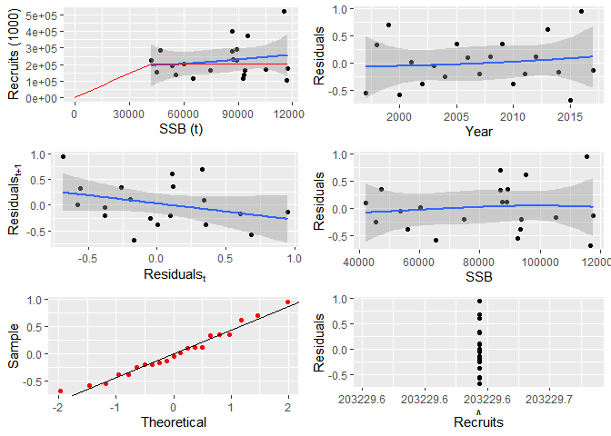<!-- -->

### Recruitment residuals

For the projection period, we need to define recruitment residuals,
i.e. the deviation of the realised recruitment from the deterministic
model.

Because the model is only fitting to 1997-2017, we only have 21
residuals from which we could resample. One way to increase this, is to
fit a kernel density smoother to these residuals and then sample from
this “smooth” distribution.

We can visualise this process with one example replicate:

``` r
### find years where residuals are required
yrs_res <- colnames(rec(sr))[which(is.na(iterMeans(rec(sr))))]
iter_i <- 1 ### example replicate
set.seed(iter_i)
### get residuals
res_i <- c(FLCore::iter(residuals(sr), iter_i))
res_i <- res_i[!is.na(res_i)]
res_i
```

    ##  [1] -0.39667331  0.18032194  0.73624884 -0.06610507  0.17233101 -0.32619588
    ##  [7] -0.09905677 -0.31577230  0.52905776 -0.05367521  0.12643406 -0.14706790
    ## [13]  0.19121622 -0.20670682  0.10402039  0.08797301  0.51855970 -0.35727852
    ## [19] -0.17254420  0.62256026 -1.12844082

``` r
hist(res_i, xlim = c(-1.5, 1.5), ylim = c(0, 2),
     xlab = "residuals", main = "", freq = FALSE,
     breaks = 10)
### calculate kernel density of residuals
density <- density(x = res_i)
### add to plot
lines(density, col = "red")
### sample residuals
mu <- sample(x = res_i, size = length(yrs_res), replace = TRUE)
### "smooth", i.e. sample from density distribution
res_new <- rnorm(n = length(yrs_res), mean = mu, sd = density$bw)
hist(res_new, col = NULL, border = "blue", add = TRUE, freq = FALSE)
```

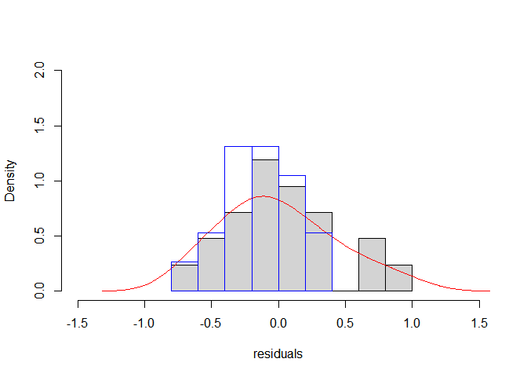<!-- -->

Do this for all replicates:

``` r
yrs_res <- colnames(rec(sr))[which(is.na(iterMeans(rec(sr))))]
### use foreach to loop through replicates
sr_res <- foreach(iter_i = seq(dim(sr)[6])) %do% {
  set.seed(iter_i)
  ### get residuals for current iteration
  res_i <- c(FLCore::iter(residuals(sr), iter_i))
  res_i <- res_i[!is.na(res_i)]
  ### calculate kernel density of residuals
  density <- density(x = res_i)
  ### sample residuals
  mu <- sample(x = res_i, size = length(yrs_res), replace = TRUE)
  ### "smooth", i.e. sample from density distribution
  res_new <- rnorm(n = length(yrs_res), mean = mu, sd = density$bw)
  return(res_new)
}
### insert into model
residuals(sr)[, yrs_res] <- unlist(sr_res)
### residuals are on log-scale
### exponentiate to get multiplicative factor
residuals(sr) <- exp(residuals(sr))
sr_res <- residuals(sr)
plot(sr_res)
```

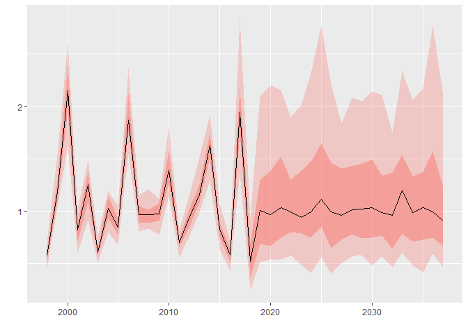<!-- -->

## Process error (not used here)

~~SAM assumes a process error, i.e. the estimated numbers at age do not
follow the catch equation exactly but include some error. For the MSE,
we want mimic behaviour.~~

~~SAM quantifies this process error as a standard deviation. This
standard deviation is age-dependent but assumed constant over time. In
SAM, many quantities, including uncertainty, are on a log-scale, so we
need to make sure to get them back to a normal scale. We will save this
error as an multiplicative factor in an `FLQuant`.~~

``` r
# ### create noise for process error
# proc_res <- stock.n(stk_stf) %=% 0 ### template FLQuant
# set.seed(3) ### set random number seed
# ### create noise by using the SDs
# proc_res[] <- stats::rnorm(n = length(proc_res), mean = 0, 
#                            sd = uncertainty$proc_error)
# ### the proc_res values are for log numbers -> exponentiate
# proc_res <- exp(proc_res)
# ### proc_res is a factor by which the numbers at age are multiplied
# ### for historical period, numbers already include process error from SAM
# ### -> remove
# proc_res[, dimnames(proc_res)$year <= 2017] <- 1
# ### remove deviation for first age class (recruits)
# ### the recruitment uncertainty is defined with the recruitment model
# proc_res[1, ] <- 1
# ### save values in stock recruitment model because
# ### this gets passed on to the projection module in MSE
# fitted(sr) <- proc_res
# plot(window(proc_res, start = 2010))
```

## Deterministic OM

Create a second (deterministic) OM which is based on the point estimates
from SAM and ignores the assessment uncertainty.

``` r
### use stochastic OM as template
stk_stf_det <- stk_stf
### overwrite historical data with point estimates
stk_stf_det[, ac(1963:2017)] <- stk_orig[, ac(1963:2017)]
```

For the projection period, biological parameters (weights at age,
maturity, etc) can stay the same because they do not differ by
replicate.

Selectivity needs to be updated because the selectivity samples in the
stochastic OM are sampled from replicate-specific values.

``` r
### update and insert
sel_vals_det <- as.numeric(sapply(seq(n), function(x) {
  c(harvest(stk_stf_det)[, sel_samples_iter[[x]],,,, x])
}))
harvest(stk_stf_det)[, bio_yrs] <- sel_vals_det

### selectivity for stochastic OM
plot(harvest(stk_stf), probs = c(0.05, 0.25, 0.5, 0.75, 0.95)) + 
  geom_vline(xintercept = 2017.5)
```

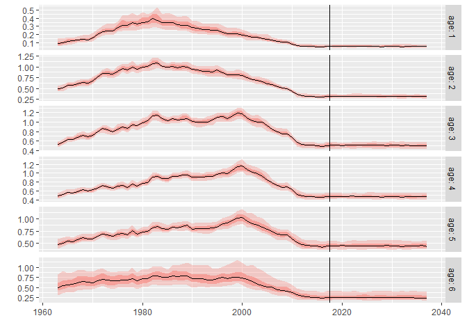<!-- -->

``` r
### selectivity for deterministic OM
plot(harvest(stk_stf_det), probs = c(0.05, 0.25, 0.5, 0.75, 0.95)) + 
  geom_vline(xintercept = 2017.5)
```

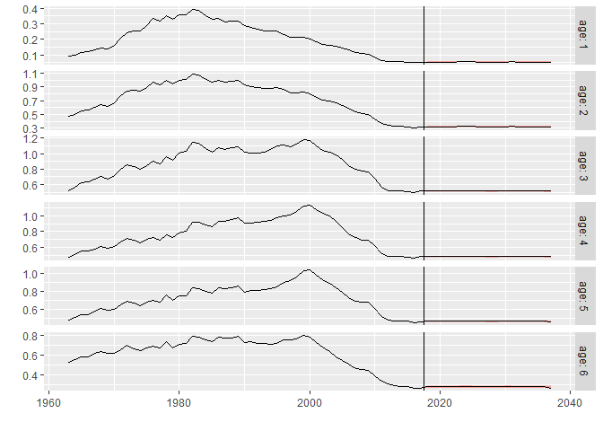<!-- -->

Also, the recruitment model needs to be updated, because SSB and R are
the same for every replicate.

``` r
### fit model to SAM point estimate
sr_det <- as.FLSR(window(stk_orig, start = 1997, 
                         end = dims(stk_stf_det)$maxyear), 
                  model = "segreg")

sr_det <- fmle(sr_det, control = list(trace = 0)) # trace = 0 turns off console output
### propagate (add replcates), but keep same values for all replicates
sr_det <- propagate(sr_det, n)
### create residuals for every projection replicate
sr_res_det <- foreach(iter_i = seq(dim(sr_det)[6])) %do% {
  set.seed(iter_i)
  ### get residuals for current iteration
  res_i <- c(FLCore::iter(residuals(sr_det), iter_i))
  res_i <- res_i[!is.na(res_i)]
  ### calculate kernel density of residuals
  density <- density(x = res_i)
  ### sample residuals
  mu <- sample(x = res_i, size = length(yrs_res), replace = TRUE)
  ### "smooth", i.e. sample from density distribution
  res_new <- rnorm(n = length(yrs_res), mean = mu, sd = density$bw)
  return(res_new)
}
### insert into model
residuals(sr_det)[, yrs_res] <- unlist(sr_res_det)
### residuals are on log-scale
### exponentiate to get multiplicative factor
residuals(sr_det) <- exp(residuals(sr_det))
sr_res_det <- residuals(sr_det)
plot(sr_res_det)
```

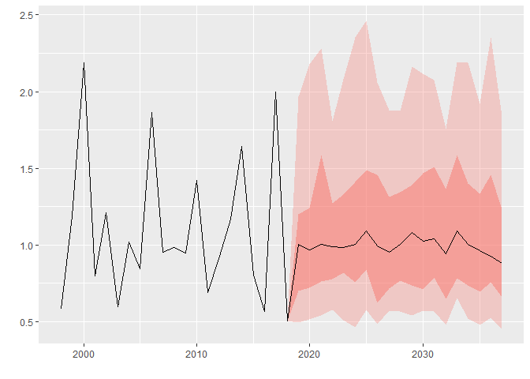<!-- -->

## Save

This concludes the conditioning of the OM. Lets save the results so that
we can use them later.

``` r
### save in OM folder
path <- "OM_files/cod4/"
dir.create(path, recursive = TRUE)
```

    ## Warning in dir.create(path, recursive = TRUE): 'OM_files\cod4' already exists

``` r
### stock
saveRDS(stk_stf, file = paste0(path, "stk.rds"))
saveRDS(stk_stf_det, file = paste0(path, "stk_det.rds"))
### stock recruitment
saveRDS(sr, file = paste0(path, "sr.rds"))
saveRDS(sr_det, file = paste0(path, "sr_det.rds"))
### recruitment residuals
saveRDS(sr_res, file = paste0(path, "sr_res.rds"))
saveRDS(sr_res_det, file = paste0(path, "sr_res_det.rds"))
```

## Try projecting

``` r
### set target
ctrl <- fwdControl(data.frame(year = 2018:2037, 
                              quantity = "f", 
                              val = 0.3))
### project forward with stochastic OM
stk_fwd <- stk_stf
stk_fwd <- fwd(stk_fwd, ctrl = ctrl, sr = sr, sr.residuals = sr_res,
               sr.residuals.mult = TRUE, maxF = 5)[]
### with deterministic OM
stk_fwd_det <- stk_stf_det
stk_fwd_det <- fwd(stk_fwd_det, ctrl = ctrl, sr = sr_det, sr.residuals = sr_res_det,
                   sr.residuals.mult = TRUE, maxF = 5)[]

### compare results
plot(FLStocks(stochastic = stk_fwd, deterministic = stk_fwd_det), 
     probs = c(0.05, 0.25, 0.5, 0.75, 0.95)) + geom_vline(xintercept = 2017.5)
```

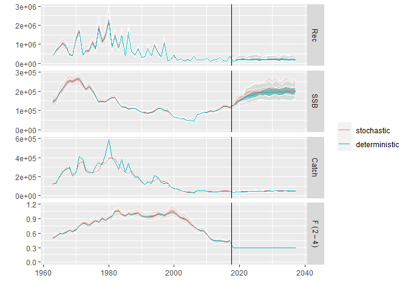<!-- -->
