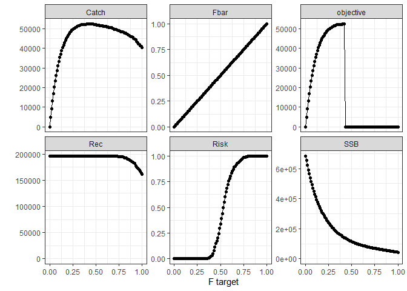
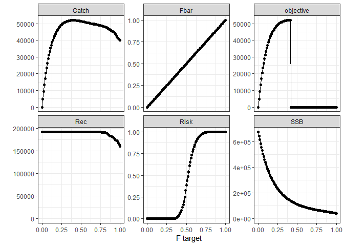
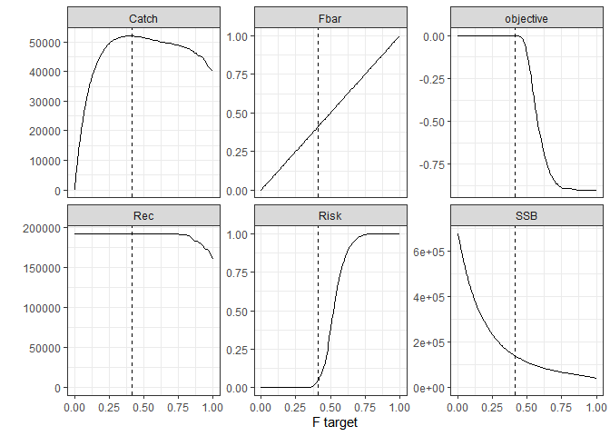

NS cod example - find MSY
================

## Background

This document illustrates finding MSY for NS cod with a stochastic OM.

## Load R packages

``` r
library(doParallel)
library(tidyr)
library(dplyr)
library(FLCore)
library(FLash)
library(ggplotFL)

source("funs.R")
```

## Load OM(s)

Load stochastic and deterministic OMs

``` r
### FLStock
stk <- readRDS("OM_files/cod4/stk.rds")
stk_det <- readRDS("OM_files/cod4/stk_det.rds")
### recruitment model and residuals
sr <- readRDS("OM_files/cod4/sr.rds")
sr_det <- readRDS("OM_files/cod4/sr_det.rds")
sr_res <- readRDS("OM_files/cod4/sr_res.rds")
sr_res_det <- readRDS("OM_files/cod4/sr_res_det.rds")
```

## Stochastic OM

### Explore search space

First, run some F values:

``` r
### define projection
proj_yrs <- 2018:2037 ### years used in projection
Blim <- 107000 ### from ICES WGNSSK 2018 and used by WKNSMSE 2019
risk_limit <- 0.05 ### 5% risk limit
stat_yrs <- 2028:2037 ### years in which catch and risk are calculated (last 10)
### set up environment for storing results
env_stochastic <- new.env()
### this is needed because "optimise" does not store results
### run a few values
fs <- seq(0, 1, 0.01)
. <- foreach(target = fs) %do% {
  proj_stats(stk = stk, sr = sr, sr_res = sr_res, proj_yrs = proj_yrs, 
             target = target,
             Blim = Blim, risk_limit = risk_limit, stat_yrs = stat_yrs,
             trace = TRUE, trace_env = env_stochastic)
}
```

    ##    target       SSB     Catch      Fbar       Rec      Risk objective 
    ##       0.0  684497.1       0.0       0.0  196327.4       0.0       0.0 
    ##     target        SSB      Catch       Fbar        Rec       Risk  objective 
    ##      0.010 653520.151   4797.084      0.010 196327.428      0.000   4797.084 
    ##     target        SSB      Catch       Fbar        Rec       Risk  objective 
    ##      0.020 621066.624   9189.577      0.020 196327.428      0.000   9189.577 
    ##    target       SSB     Catch      Fbar       Rec      Risk objective 
    ##      0.03 591790.62  13226.70      0.03 196327.43      0.00  13226.70 
    ##    target       SSB     Catch      Fbar       Rec      Risk objective 
    ##      0.04 565196.70  16887.10      0.04 196327.43      0.00  16887.10 
    ##    target       SSB     Catch      Fbar       Rec      Risk objective 
    ##      0.05 538742.22  20175.85      0.05 196327.43      0.00  20175.85 
    ##    target       SSB     Catch      Fbar       Rec      Risk objective 
    ##      0.06 514824.11  23234.89      0.06 196327.43      0.00  23234.89 
    ##    target       SSB     Catch      Fbar       Rec      Risk objective 
    ##      0.07 492031.53  26096.38      0.07 196327.43      0.00  26096.38 
    ##    target       SSB     Catch      Fbar       Rec      Risk objective 
    ##      0.08 469980.93  28752.88      0.08 196327.43      0.00  28752.88 
    ##    target       SSB     Catch      Fbar       Rec      Risk objective 
    ##      0.09 449338.86  31130.54      0.09 196327.43      0.00  31130.54 
    ##    target       SSB     Catch      Fbar       Rec      Risk objective 
    ##      0.10 429938.34  33325.72      0.10 196327.43      0.00  33325.72 
    ##    target       SSB     Catch      Fbar       Rec      Risk objective 
    ##      0.11 411980.73  35278.76      0.11 196327.43      0.00  35278.76 
    ##    target       SSB     Catch      Fbar       Rec      Risk objective 
    ##      0.12 394438.48  37091.08      0.12 196327.43      0.00  37091.08 
    ##    target       SSB     Catch      Fbar       Rec      Risk objective 
    ##      0.13 378452.45  38702.05      0.13 196327.43      0.00  38702.05 
    ##    target       SSB     Catch      Fbar       Rec      Risk objective 
    ##      0.14 363069.30  40195.64      0.14 196327.43      0.00  40195.64 
    ##    target       SSB     Catch      Fbar       Rec      Risk objective 
    ##      0.15 348959.59  41587.21      0.15 196327.43      0.00  41587.21 
    ##    target       SSB     Catch      Fbar       Rec      Risk objective 
    ##      0.16 335067.74  42858.20      0.16 196327.43      0.00  42858.20 
    ##    target       SSB     Catch      Fbar       Rec      Risk objective 
    ##      0.17 321934.64  43991.69      0.17 196327.43      0.00  43991.69 
    ##    target       SSB     Catch      Fbar       Rec      Risk objective 
    ##      0.18 309936.04  44909.68      0.18 196327.43      0.00  44909.68 
    ##    target       SSB     Catch      Fbar       Rec      Risk objective 
    ##      0.19 298375.51  45762.13      0.19 196327.43      0.00  45762.13 
    ##    target       SSB     Catch      Fbar       Rec      Risk objective 
    ##      0.20 287336.34  46590.35      0.20 196327.43      0.00  46590.35 
    ##    target       SSB     Catch      Fbar       Rec      Risk objective 
    ##      0.21 276981.44  47312.89      0.21 196327.43      0.00  47312.89 
    ##    target       SSB     Catch      Fbar       Rec      Risk objective 
    ##      0.22 266859.31  47956.97      0.22 196327.43      0.00  47956.97 
    ##    target       SSB     Catch      Fbar       Rec      Risk objective 
    ##      0.23 256935.62  48657.23      0.23 196327.43      0.00  48657.23 
    ##    target       SSB     Catch      Fbar       Rec      Risk objective 
    ##      0.24 247940.04  49205.90      0.24 196327.43      0.00  49205.90 
    ##    target       SSB     Catch      Fbar       Rec      Risk objective 
    ##      0.25 239076.09  49584.76      0.25 196327.43      0.00  49584.76 
    ##    target       SSB     Catch      Fbar       Rec      Risk objective 
    ##      0.26 230902.48  50027.80      0.26 196327.43      0.00  50027.80 
    ##    target       SSB     Catch      Fbar       Rec      Risk objective 
    ##      0.27 223237.70  50264.74      0.27 196327.43      0.00  50264.74 
    ##    target       SSB     Catch      Fbar       Rec      Risk objective 
    ##      0.28 215883.89  50552.78      0.28 196327.43      0.00  50552.78 
    ##    target       SSB     Catch      Fbar       Rec      Risk objective 
    ##      0.29 208465.74  50856.98      0.29 196327.43      0.00  50856.98 
    ##    target       SSB     Catch      Fbar       Rec      Risk objective 
    ##      0.30 201633.35  51060.31      0.30 196327.43      0.00  51060.31 
    ##    target       SSB     Catch      Fbar       Rec      Risk objective 
    ##      0.31 195063.31  51333.21      0.31 196327.43      0.00  51333.21 
    ##    target       SSB     Catch      Fbar       Rec      Risk objective 
    ##      0.32 188799.15  51595.51      0.32 196327.43      0.00  51595.51 
    ##    target       SSB     Catch      Fbar       Rec      Risk objective 
    ##      0.33 182703.67  51848.29      0.33 196327.43      0.00  51848.29 
    ##    target       SSB     Catch      Fbar       Rec      Risk objective 
    ##      0.34 177166.68  51976.40      0.34 196327.43      0.00  51976.40 
    ##     target        SSB      Catch       Fbar        Rec       Risk  objective 
    ##      0.350 171762.981  52143.667      0.350 196327.428      0.002  52143.667 
    ##     target        SSB      Catch       Fbar        Rec       Risk  objective 
    ##      0.360 166537.605  52168.527      0.360 196327.428      0.004  52168.527 
    ##     target        SSB      Catch       Fbar        Rec       Risk  objective 
    ##      0.370 161785.014  52077.858      0.370 196327.428      0.008  52077.858 
    ##    target       SSB     Catch      Fbar       Rec      Risk objective 
    ##      0.38 157408.31  52072.63      0.38 196327.43      0.01  52072.63 
    ##     target        SSB      Catch       Fbar        Rec       Risk  objective 
    ##      0.390 153149.302  52164.568      0.390 196327.428      0.018  52164.568 
    ##     target        SSB      Catch       Fbar        Rec       Risk  objective 
    ##      0.400 148970.566  52296.359      0.400 196327.428      0.028  52296.359 
    ##     target        SSB      Catch       Fbar        Rec       Risk  objective 
    ##      0.410 144914.666  52371.744      0.410 196327.428      0.034  52371.744 
    ##     target        SSB      Catch       Fbar        Rec       Risk  objective 
    ##      0.420 141004.839  52378.643      0.420 196327.428      0.048  52378.643 
    ##     target        SSB      Catch       Fbar        Rec       Risk  objective 
    ##      0.430 137309.441  52357.320      0.430 196327.428      0.082     -1.000 
    ##     target        SSB      Catch       Fbar        Rec       Risk  objective 
    ##      0.440 133643.560  52316.520      0.440 196327.428      0.116     -1.000 
    ##    target       SSB     Catch      Fbar       Rec      Risk objective 
    ##      0.45 130084.77  52326.49      0.45 196327.43      0.15     -1.00 
    ##     target        SSB      Catch       Fbar        Rec       Risk  objective 
    ##      0.460 126680.781  52260.393      0.460 196327.428      0.176     -1.000 
    ##     target        SSB      Catch       Fbar        Rec       Risk  objective 
    ##      0.470 123533.488  52251.806      0.470 196327.428      0.206     -1.000 
    ##     target        SSB      Catch       Fbar        Rec       Risk  objective 
    ##      0.480 120342.107  52189.128      0.480 196327.428      0.246     -1.000 
    ##     target        SSB      Catch       Fbar        Rec       Risk  objective 
    ##      0.490 117422.649  52103.834      0.490 196327.428      0.296     -1.000 
    ##     target        SSB      Catch       Fbar        Rec       Risk  objective 
    ##      0.500 114685.986  52003.763      0.500 196327.428      0.336     -1.000 
    ##    target       SSB     Catch      Fbar       Rec      Risk objective 
    ##      0.51 112043.30  51897.93      0.51 196327.43      0.39     -1.00 
    ##     target        SSB      Catch       Fbar        Rec       Risk  objective 
    ##      0.520 109419.687  51790.063      0.520 196327.428      0.438     -1.000 
    ##    target       SSB     Catch      Fbar       Rec      Risk objective 
    ##      0.53 106995.60  51733.94      0.53 196327.43      0.50     -1.00 
    ##     target        SSB      Catch       Fbar        Rec       Risk  objective 
    ##      0.540 104633.313  51588.596      0.540 196327.428      0.552     -1.000 
    ##     target        SSB      Catch       Fbar        Rec       Risk  objective 
    ##      0.550 102379.369  51543.941      0.550 196327.428      0.606     -1.000 
    ##     target        SSB      Catch       Fbar        Rec       Risk  objective 
    ##      0.560 100260.790  51440.566      0.560 196327.428      0.652     -1.000 
    ##     target        SSB      Catch       Fbar        Rec       Risk  objective 
    ##      0.570  98169.045  51327.583      0.570 196327.428      0.686     -1.000 
    ##     target        SSB      Catch       Fbar        Rec       Risk  objective 
    ##      0.580  96006.854  51218.379      0.580 196327.428      0.724     -1.000 
    ##     target        SSB      Catch       Fbar        Rec       Risk  objective 
    ##      0.590  94045.502  51177.316      0.590 196327.428      0.756     -1.000 
    ##     target        SSB      Catch       Fbar        Rec       Risk  objective 
    ##      0.600  91912.044  51075.829      0.600 196327.428      0.778     -1.000 
    ##     target        SSB      Catch       Fbar        Rec       Risk  objective 
    ##      0.610  90023.421  51089.432      0.610 196327.428      0.806     -1.000 
    ##     target        SSB      Catch       Fbar        Rec       Risk  objective 
    ##      0.620  88415.873  50893.875      0.620 196327.428      0.832     -1.000 
    ##    target       SSB     Catch      Fbar       Rec      Risk objective 
    ##      0.63  86545.18  50804.79      0.63 196327.43      0.85     -1.00 
    ##    target       SSB     Catch      Fbar       Rec      Risk objective 
    ##      0.64  84795.13  50662.10      0.64 196327.43      0.87     -1.00 
    ##     target        SSB      Catch       Fbar        Rec       Risk  objective 
    ##      0.650  83116.960  50616.177      0.650 196327.428      0.892     -1.000 
    ##     target        SSB      Catch       Fbar        Rec       Risk  objective 
    ##      0.660  81785.268  50541.032      0.660 195526.134      0.898     -1.000 
    ##     target        SSB      Catch       Fbar        Rec       Risk  objective 
    ##      0.670  80336.453  50391.601      0.670 195526.134      0.916     -1.000 
    ##     target        SSB      Catch       Fbar        Rec       Risk  objective 
    ##      0.680  78822.131  50198.791      0.680 195526.134      0.926     -1.000 
    ##     target        SSB      Catch       Fbar        Rec       Risk  objective 
    ##      0.690  77409.316  50019.279      0.690 195526.134      0.936     -1.000 
    ##     target        SSB      Catch       Fbar        Rec       Risk  objective 
    ##      0.700  76109.397  49740.903      0.700 195526.134      0.942     -1.000 
    ##    target       SSB     Catch      Fbar       Rec      Risk objective 
    ##      0.71  74881.17  49603.91      0.71 195526.13      0.95     -1.00 
    ##     target        SSB      Catch       Fbar        Rec       Risk  objective 
    ##      0.720  73581.587  49442.834      0.720 195526.134      0.958     -1.000 
    ##     target        SSB      Catch       Fbar        Rec       Risk  objective 
    ##      0.730  72203.348  49295.582      0.730 195526.134      0.966     -1.000 
    ##     target        SSB      Catch       Fbar        Rec       Risk  objective 
    ##      0.740  70895.290  49090.715      0.740 195365.603      0.974     -1.000 
    ##     target        SSB      Catch       Fbar        Rec       Risk  objective 
    ##      0.750  69683.514  48889.176      0.750 195365.603      0.984     -1.000 
    ##     target        SSB      Catch       Fbar        Rec       Risk  objective 
    ##      0.760  68508.367  48567.161      0.760 194375.667      0.984     -1.000 
    ##     target        SSB      Catch       Fbar        Rec       Risk  objective 
    ##      0.770  67215.256  48467.674      0.770 194339.464      0.986     -1.000 
    ##    target       SSB     Catch      Fbar       Rec      Risk objective 
    ##      0.78  66100.58  48352.62      0.78 194339.46      0.99     -1.00 
    ##     target        SSB      Catch       Fbar        Rec       Risk  objective 
    ##      0.790  64951.049  48292.522      0.790 194339.464      0.994     -1.000 
    ##     target        SSB      Catch       Fbar        Rec       Risk  objective 
    ##      0.800  63967.245  48047.162      0.800 193250.362      0.998     -1.000 
    ##     target        SSB      Catch       Fbar        Rec       Risk  objective 
    ##      0.810  62789.669  47892.697      0.810 192949.087      0.998     -1.000 
    ##     target        SSB      Catch       Fbar        Rec       Risk  objective 
    ##      0.820  61820.951  47751.631      0.820 192949.087      0.998     -1.000 
    ##     target        SSB      Catch       Fbar        Rec       Risk  objective 
    ##      0.830  60807.724  47565.223      0.830 192843.655      0.998     -1.000 
    ##     target        SSB      Catch       Fbar        Rec       Risk  objective 
    ##      0.840  59844.844  47037.297      0.840 190779.424      0.998     -1.000 
    ##     target        SSB      Catch       Fbar        Rec       Risk  objective 
    ##      0.850  58922.455  46734.087      0.850 190525.344      0.998     -1.000 
    ##     target        SSB      Catch       Fbar        Rec       Risk  objective 
    ##      0.860  57868.493  46597.604      0.860 189138.412      0.998     -1.000 
    ##     target        SSB      Catch       Fbar        Rec       Risk  objective 
    ##      0.870  56878.656  46337.915      0.870 187659.303      0.998     -1.000 
    ##     target        SSB      Catch       Fbar        Rec       Risk  objective 
    ##      0.880  55842.627  46011.732      0.880 186874.423      0.998     -1.000 
    ##     target        SSB      Catch       Fbar        Rec       Risk  objective 
    ##      0.890  54936.465  45827.834      0.890 185553.845      0.998     -1.000 
    ##     target        SSB      Catch       Fbar        Rec       Risk  objective 
    ##      0.900  53905.812  45524.662      0.900 184527.646      0.998     -1.000 
    ##     target        SSB      Catch       Fbar        Rec       Risk  objective 
    ##      0.910  52737.583  45085.970      0.910 183539.446      0.998     -1.000 
    ##     target        SSB      Catch       Fbar        Rec       Risk  objective 
    ##      0.920  51623.601  44643.156      0.920 182581.838      0.998     -1.000 
    ##     target        SSB      Catch       Fbar        Rec       Risk  objective 
    ##      0.930  50451.089  44246.573      0.930 178061.698      0.998     -1.000 
    ##     target        SSB      Catch       Fbar        Rec       Risk  objective 
    ##      0.940  49368.032  43304.255      0.940 174749.600      0.998     -1.000 
    ##     target        SSB      Catch       Fbar        Rec       Risk  objective 
    ##      0.950  48363.254  42777.132      0.950 172449.632      0.998     -1.000 
    ##     target        SSB      Catch       Fbar        Rec       Risk  objective 
    ##      0.960  47356.950  42334.769      0.960 171872.295      0.998     -1.000 
    ##    target       SSB     Catch      Fbar       Rec      Risk objective 
    ##      0.97  46432.65  41938.12      0.97 169699.22      1.00     -1.00 
    ##    target       SSB     Catch      Fbar       Rec      Risk objective 
    ##      0.98  45421.87  41362.87      0.98 167018.33      1.00     -1.00 
    ##    target       SSB     Catch      Fbar       Rec      Risk objective 
    ##      0.99  44456.78  40870.64      0.99 163457.60      1.00     -1.00 
    ##    target       SSB     Catch      Fbar       Rec      Risk objective 
    ##      1.00  43527.29  40389.41      1.00 161262.62      1.00     -1.00

``` r
runs_stochastic <- bind_rows(get("res_trace", envir = env_stochastic))
```

We can visualise the results

``` r
runs_stochastic %>%
    pivot_longer(SSB:objective) %>%
    ggplot(aes(x = target, y = value)) +
    facet_wrap(~name, scales = "free_y") +
    geom_line() + geom_point() +
    labs(x = "F target", y = "") +
    geom_blank(data = data.frame(target = 0, value = 0), aes(target, value)) +
    theme_bw()
```

<!-- -->

### Find MSY

The highest catch where Blim risk is \<= 5% is somewhere between F = 0.2
and F = 0.5. We can use `optimise` (a golden section search) to find
MSY:

``` r
### find optimum
MSY_stochastic <- optimise(f = proj_stats, 
                           stk = stk, sr = sr, sr_res = sr_res, 
                           proj_yrs = proj_yrs, Blim = Blim, 
                           risk_limit = risk_limit, stat_yrs = stat_yrs,
                           trace = TRUE, trace_env = env_stochastic,
                           interval = c(0.2, 0.5),
                           lower = 0.2, upper = 0.5,
                           maximum = TRUE,
                           tol = 0.00001)
```

    ##       target          SSB        Catch         Fbar          Rec         Risk 
    ## 3.145898e-01 1.923483e+05 5.145413e+04 3.145898e-01 1.963274e+05 0.000000e+00 
    ##    objective 
    ## 5.145413e+04 
    ##       target          SSB        Catch         Fbar          Rec         Risk 
    ## 3.854102e-01 1.550617e+05 5.214803e+04 3.854102e-01 1.963274e+05 1.400000e-02 
    ##    objective 
    ## 5.214803e+04 
    ##        target           SSB         Catch          Fbar           Rec 
    ##  4.291796e-01  1.376195e+05  5.236375e+04  4.291796e-01  1.963274e+05 
    ##          Risk     objective 
    ##  7.600000e-02 -1.000000e+00 
    ##       target          SSB        Catch         Fbar          Rec         Risk 
    ## 3.504673e-01 1.715158e+05 5.214201e+04 3.504673e-01 1.963274e+05 2.000000e-03 
    ##    objective 
    ## 5.214201e+04 
    ##       target          SSB        Catch         Fbar          Rec         Risk 
    ## 3.682599e-01 1.625689e+05 5.210295e+04 3.682599e-01 1.963274e+05 8.000000e-03 
    ##    objective 
    ## 5.210295e+04 
    ##       target          SSB        Catch         Fbar          Rec         Risk 
    ## 4.021286e-01 1.480330e+05 5.231497e+04 4.021286e-01 1.963274e+05 3.000000e-02 
    ##    objective 
    ## 5.231497e+04 
    ##       target          SSB        Catch         Fbar          Rec         Risk 
    ## 4.124612e-01 1.439328e+05 5.233753e+04 4.124612e-01 1.963274e+05 3.800000e-02 
    ##    objective 
    ## 5.233753e+04 
    ##       target          SSB        Catch         Fbar          Rec         Risk 
    ## 4.110795e-01 1.444828e+05 5.235875e+04 4.110795e-01 1.963274e+05 3.600000e-02 
    ##    objective 
    ## 5.235875e+04 
    ##       target          SSB        Catch         Fbar          Rec         Risk 
    ## 4.078518e-01 1.457747e+05 5.236733e+04 4.078518e-01 1.963274e+05 3.400000e-02 
    ##    objective 
    ## 5.236733e+04 
    ##       target          SSB        Catch         Fbar          Rec         Risk 
    ## 4.056658e-01 1.466306e+05 5.235421e+04 4.056658e-01 1.963274e+05 3.200000e-02 
    ##    objective 
    ## 5.235421e+04 
    ##       target          SSB        Catch         Fbar          Rec         Risk 
    ## 4.086344e-01 1.454639e+05 5.237309e+04 4.086344e-01 1.963274e+05 3.400000e-02 
    ##    objective 
    ## 5.237309e+04 
    ##       target          SSB        Catch         Fbar          Rec         Risk 
    ## 4.091411e-01 1.452597e+05 5.237225e+04 4.091411e-01 1.963274e+05 3.400000e-02 
    ##    objective 
    ## 5.237225e+04 
    ##       target          SSB        Catch         Fbar          Rec         Risk 
    ## 4.087693e-01 1.454095e+05 5.237287e+04 4.087693e-01 1.963274e+05 3.400000e-02 
    ##    objective 
    ## 5.237287e+04 
    ##       target          SSB        Catch         Fbar          Rec         Risk 
    ## 4.083355e-01 1.455845e+05 5.237357e+04 4.083355e-01 1.963274e+05 3.400000e-02 
    ##    objective 
    ## 5.237357e+04 
    ##       target          SSB        Catch         Fbar          Rec         Risk 
    ## 4.081508e-01 1.456583e+05 5.237166e+04 4.081508e-01 1.963274e+05 3.400000e-02 
    ##    objective 
    ## 5.237166e+04 
    ##       target          SSB        Catch         Fbar          Rec         Risk 
    ## 4.084497e-01 1.455384e+05 5.237339e+04 4.084497e-01 1.963274e+05 3.400000e-02 
    ##    objective 
    ## 5.237339e+04 
    ##       target          SSB        Catch         Fbar          Rec         Risk 
    ## 4.082649e-01 1.456130e+05 5.237331e+04 4.082649e-01 1.963274e+05 3.400000e-02 
    ##    objective 
    ## 5.237331e+04 
    ##       target          SSB        Catch         Fbar          Rec         Risk 
    ## 4.083644e-01 1.455728e+05 5.237352e+04 4.083644e-01 1.963274e+05 3.400000e-02 
    ##    objective 
    ## 5.237352e+04 
    ##       target          SSB        Catch         Fbar          Rec         Risk 
    ## 4.083085e-01 1.455954e+05 5.237361e+04 4.083085e-01 1.963274e+05 3.400000e-02 
    ##    objective 
    ## 5.237361e+04 
    ##       target          SSB        Catch         Fbar          Rec         Risk 
    ## 4.082919e-01 1.456021e+05 5.237364e+04 4.082919e-01 1.963274e+05 3.400000e-02 
    ##    objective 
    ## 5.237364e+04 
    ##       target          SSB        Catch         Fbar          Rec         Risk 
    ## 4.082816e-01 1.456063e+05 5.237355e+04 4.082816e-01 1.963274e+05 3.400000e-02 
    ##    objective 
    ## 5.237355e+04 
    ##       target          SSB        Catch         Fbar          Rec         Risk 
    ## 4.082983e-01 1.455996e+05 5.237363e+04 4.082983e-01 1.963274e+05 3.400000e-02 
    ##    objective 
    ## 5.237363e+04 
    ##       target          SSB        Catch         Fbar          Rec         Risk 
    ## 4.082880e-01 1.456037e+05 5.237364e+04 4.082880e-01 1.963274e+05 3.400000e-02 
    ##    objective 
    ## 5.237364e+04 
    ##       target          SSB        Catch         Fbar          Rec         Risk 
    ## 4.082880e-01 1.456037e+05 5.237364e+04 4.082880e-01 1.963274e+05 3.400000e-02 
    ##    objective 
    ## 5.237364e+04

``` r
### Fmsy is
MSY_stochastic$maximum
```

    ## [1] 0.408288

``` r
### extract results
runs_stochastic <- bind_rows(bind_rows(runs_stochastic,
                                       get("res_trace", envir = env_stochastic)))
saveRDS(runs_stochastic, "OM_files/cod4/MSY_runs_stochastic.rds")

### plot
runs_stochastic %>%
    pivot_longer(SSB:objective) %>%
    ggplot(aes(x = target, y = value)) +
    facet_wrap(~name, scales = "free_y") +
    geom_line() +
    geom_vline(xintercept = MSY_stochastic$maximum, linetype = "dashed") + 
    labs(x = "F target", y = "") +
    geom_blank(data = data.frame(target = 0, value = 0), aes(target, value)) +
    theme_bw()
```

<!-- -->

## Do the same for the “deterministic” OM

``` r
env_det <- new.env()
### this is needed because "optimise" does not store results
### run a few values
fs <- seq(0, 1, 0.01)
. <- foreach(target = fs) %do% {
  proj_stats(stk = stk_det, sr = sr_det, sr_res = sr_res_det, 
             proj_yrs = proj_yrs, 
             target = target,
             Blim = Blim, risk_limit = risk_limit, stat_yrs = stat_yrs,
             trace = TRUE, trace_env = env_det)
}
```

    ##    target       SSB     Catch      Fbar       Rec      Risk objective 
    ##       0.0  678240.9       0.0       0.0  192255.9       0.0       0.0 
    ##     target        SSB      Catch       Fbar        Rec       Risk  objective 
    ##      0.010 646345.654   4875.931      0.010 192255.863      0.000   4875.931 
    ##     target        SSB      Catch       Fbar        Rec       Risk  objective 
    ##      0.020 615775.270   9311.951      0.020 192255.863      0.000   9311.951 
    ##    target       SSB     Catch      Fbar       Rec      Risk objective 
    ##      0.03 586041.10  13357.87      0.03 192255.86      0.00  13357.87 
    ##    target       SSB     Catch      Fbar       Rec      Risk objective 
    ##      0.04 558089.18  17078.33      0.04 192255.86      0.00  17078.33 
    ##    target       SSB     Catch      Fbar       Rec      Risk objective 
    ##      0.05 531517.75  20464.79      0.05 192255.86      0.00  20464.79 
    ##    target       SSB     Catch      Fbar       Rec      Risk objective 
    ##      0.06 506185.89  23508.35      0.06 192255.86      0.00  23508.35 
    ##    target       SSB     Catch      Fbar       Rec      Risk objective 
    ##      0.07 483615.57  26338.78      0.07 192255.86      0.00  26338.78 
    ##    target       SSB     Catch      Fbar       Rec      Risk objective 
    ##      0.08 461926.07  28946.38      0.08 192255.86      0.00  28946.38 
    ##    target       SSB     Catch      Fbar       Rec      Risk objective 
    ##      0.09 442207.80  31286.83      0.09 192255.86      0.00  31286.83 
    ##    target       SSB     Catch      Fbar       Rec      Risk objective 
    ##      0.10 423653.77  33418.59      0.10 192255.86      0.00  33418.59 
    ##    target       SSB     Catch      Fbar       Rec      Risk objective 
    ##      0.11 405605.99  35384.21      0.11 192255.86      0.00  35384.21 
    ##    target       SSB     Catch      Fbar       Rec      Risk objective 
    ##      0.12 388236.08  37100.59      0.12 192255.86      0.00  37100.59 
    ##    target       SSB     Catch      Fbar       Rec      Risk objective 
    ##      0.13 371846.43  38690.26      0.13 192255.86      0.00  38690.26 
    ##    target       SSB     Catch      Fbar       Rec      Risk objective 
    ##      0.14 356775.97  40130.95      0.14 192255.86      0.00  40130.95 
    ##    target       SSB     Catch      Fbar       Rec      Risk objective 
    ##      0.15 342470.87  41514.09      0.15 192255.86      0.00  41514.09 
    ##    target       SSB     Catch      Fbar       Rec      Risk objective 
    ##      0.16 329158.58  42614.17      0.16 192255.86      0.00  42614.17 
    ##    target       SSB     Catch      Fbar       Rec      Risk objective 
    ##      0.17 316617.39  43679.39      0.17 192255.86      0.00  43679.39 
    ##    target       SSB     Catch      Fbar       Rec      Risk objective 
    ##      0.18 303977.53  44648.50      0.18 192255.86      0.00  44648.50 
    ##    target       SSB     Catch      Fbar       Rec      Risk objective 
    ##      0.19 292508.96  45513.93      0.19 192255.86      0.00  45513.93 
    ##    target       SSB     Catch      Fbar       Rec      Risk objective 
    ##      0.20 281691.67  46343.03      0.20 192255.86      0.00  46343.03 
    ##    target       SSB     Catch      Fbar       Rec      Risk objective 
    ##      0.21 270790.55  47084.57      0.21 192255.86      0.00  47084.57 
    ##    target       SSB     Catch      Fbar       Rec      Risk objective 
    ##      0.22 260541.36  47681.64      0.22 192255.86      0.00  47681.64 
    ##    target       SSB     Catch      Fbar       Rec      Risk objective 
    ##      0.23 251266.07  48271.39      0.23 192255.86      0.00  48271.39 
    ##    target       SSB     Catch      Fbar       Rec      Risk objective 
    ##      0.24 242275.09  48829.08      0.24 192255.86      0.00  48829.08 
    ##    target       SSB     Catch      Fbar       Rec      Risk objective 
    ##      0.25 233840.84  49318.31      0.25 192255.86      0.00  49318.31 
    ##    target       SSB     Catch      Fbar       Rec      Risk objective 
    ##      0.26 225617.07  49732.17      0.26 192255.86      0.00  49732.17 
    ##    target       SSB     Catch      Fbar       Rec      Risk objective 
    ##      0.27 217926.90  50094.09      0.27 192255.86      0.00  50094.09 
    ##    target       SSB     Catch      Fbar       Rec      Risk objective 
    ##      0.28 210538.46  50388.65      0.28 192255.86      0.00  50388.65 
    ##    target       SSB     Catch      Fbar       Rec      Risk objective 
    ##      0.29 203736.87  50670.44      0.29 192255.86      0.00  50670.44 
    ##    target       SSB     Catch      Fbar       Rec      Risk objective 
    ##       0.3  197255.0   50890.7       0.3  192255.9       0.0   50890.7 
    ##    target       SSB     Catch      Fbar       Rec      Risk objective 
    ##      0.31 191076.83  51106.34      0.31 192255.86      0.00  51106.34 
    ##    target       SSB     Catch      Fbar       Rec      Risk objective 
    ##      0.32 185153.89  51296.41      0.32 192255.86      0.00  51296.41 
    ##    target       SSB     Catch      Fbar       Rec      Risk objective 
    ##      0.33 179420.52  51483.18      0.33 192255.86      0.00  51483.18 
    ##    target       SSB     Catch      Fbar       Rec      Risk objective 
    ##      0.34 173796.53  51650.48      0.34 192255.86      0.00  51650.48 
    ##     target        SSB      Catch       Fbar        Rec       Risk  objective 
    ##      0.350 168731.615  51772.781      0.350 192255.863      0.002  51772.781 
    ##     target        SSB      Catch       Fbar        Rec       Risk  objective 
    ##      0.360 163579.527  51856.652      0.360 192255.863      0.004  51856.652 
    ##     target        SSB      Catch       Fbar        Rec       Risk  objective 
    ##      0.370 158855.049  51927.130      0.370 192255.863      0.008  51927.130 
    ##     target        SSB      Catch       Fbar        Rec       Risk  objective 
    ##      0.380 154371.376  51949.288      0.380 192255.863      0.014  51949.288 
    ##     target        SSB      Catch       Fbar        Rec       Risk  objective 
    ##      0.390 150067.017  51998.638      0.390 192255.863      0.028  51998.638 
    ##     target        SSB      Catch       Fbar        Rec       Risk  objective 
    ##      0.400 146007.455  52023.097      0.400 192255.863      0.034  52023.097 
    ##     target        SSB      Catch       Fbar        Rec       Risk  objective 
    ##      0.410 141948.602  52016.670      0.410 192255.863      0.048  52016.670 
    ##     target        SSB      Catch       Fbar        Rec       Risk  objective 
    ##      0.420 138102.287  51999.133      0.420 192255.863      0.066     -1.000 
    ##     target        SSB      Catch       Fbar        Rec       Risk  objective 
    ##      0.430 134625.103  51928.675      0.430 192255.863      0.082     -1.000 
    ##    target       SSB     Catch      Fbar       Rec      Risk objective 
    ##      0.44 131028.59  51852.95      0.44 192255.86      0.10     -1.00 
    ##     target        SSB      Catch       Fbar        Rec       Risk  objective 
    ##      0.450 127849.142  51773.780      0.450 192255.863      0.134     -1.000 
    ##    target       SSB     Catch      Fbar       Rec      Risk objective 
    ##      0.46 124650.47  51695.07      0.46 192255.86      0.16     -1.00 
    ##     target        SSB      Catch       Fbar        Rec       Risk  objective 
    ##      0.470 121365.302  51641.879      0.470 192255.863      0.196     -1.000 
    ##     target        SSB      Catch       Fbar        Rec       Risk  objective 
    ##      0.480 118259.603  51575.863      0.480 192255.863      0.252     -1.000 
    ##     target        SSB      Catch       Fbar        Rec       Risk  objective 
    ##      0.490 115403.830  51534.961      0.490 192255.863      0.324     -1.000 
    ##     target        SSB      Catch       Fbar        Rec       Risk  objective 
    ##      0.500 112674.921  51474.914      0.500 192255.863      0.384     -1.000 
    ##     target        SSB      Catch       Fbar        Rec       Risk  objective 
    ##      0.510 110191.366  51379.252      0.510 192255.863      0.436     -1.000 
    ##     target        SSB      Catch       Fbar        Rec       Risk  objective 
    ##      0.520 107697.678  51237.433      0.520 192255.863      0.486     -1.000 
    ##    target       SSB     Catch      Fbar       Rec      Risk objective 
    ##      0.53 105337.99  51056.12      0.53 192255.86      0.54     -1.00 
    ##     target        SSB      Catch       Fbar        Rec       Risk  objective 
    ##      0.540 103009.603  50970.115      0.540 192255.863      0.608     -1.000 
    ##     target        SSB      Catch       Fbar        Rec       Risk  objective 
    ##      0.550 100916.848  50846.291      0.550 192255.863      0.648     -1.000 
    ##    target       SSB     Catch      Fbar       Rec      Risk objective 
    ##      0.56  98800.25  50723.30      0.56 192255.86      0.70     -1.00 
    ##     target        SSB      Catch       Fbar        Rec       Risk  objective 
    ##      0.570  96659.243  50626.990      0.570 192255.863      0.734     -1.000 
    ##     target        SSB      Catch       Fbar        Rec       Risk  objective 
    ##      0.580  94416.019  50565.882      0.580 192255.863      0.776     -1.000 
    ##    target       SSB     Catch      Fbar       Rec      Risk objective 
    ##      0.59  92384.84  50450.65      0.59 192255.86      0.80     -1.00 
    ##    target       SSB     Catch      Fbar       Rec      Risk objective 
    ##      0.60  90469.33  50342.81      0.60 192255.86      0.83     -1.00 
    ##     target        SSB      Catch       Fbar        Rec       Risk  objective 
    ##      0.610  88676.198  50203.336      0.610 192255.863      0.852     -1.000 
    ##    target       SSB     Catch      Fbar       Rec      Risk objective 
    ##      0.62  86983.73  50032.52      0.62 192255.86      0.88     -1.00 
    ##     target        SSB      Catch       Fbar        Rec       Risk  objective 
    ##      0.630  85299.402  49964.587      0.630 192255.863      0.894     -1.000 
    ##     target        SSB      Catch       Fbar        Rec       Risk  objective 
    ##      0.640  83667.609  49861.679      0.640 192255.863      0.914     -1.000 
    ##     target        SSB      Catch       Fbar        Rec       Risk  objective 
    ##      0.650  82114.725  49752.495      0.650 192255.863      0.924     -1.000 
    ##    target       SSB     Catch      Fbar       Rec      Risk objective 
    ##      0.66  80520.32  49706.84      0.66 192255.86      0.94     -1.00 
    ##     target        SSB      Catch       Fbar        Rec       Risk  objective 
    ##      0.670  79001.377  49720.629      0.670 192255.863      0.952     -1.000 
    ##     target        SSB      Catch       Fbar        Rec       Risk  objective 
    ##      0.680  77444.992  49600.145      0.680 192255.863      0.958     -1.000 
    ##     target        SSB      Catch       Fbar        Rec       Risk  objective 
    ##      0.690  76145.409  49512.192      0.690 192255.863      0.966     -1.000 
    ##     target        SSB      Catch       Fbar        Rec       Risk  objective 
    ##      0.700  74784.607  49424.519      0.700 192255.863      0.972     -1.000 
    ##    target       SSB     Catch      Fbar       Rec      Risk objective 
    ##      0.71  73597.12  49336.80      0.71 192255.86      0.98     -1.00 
    ##     target        SSB      Catch       Fbar        Rec       Risk  objective 
    ##      0.720  72378.423  49237.550      0.720 192255.863      0.982     -1.000 
    ##     target        SSB      Catch       Fbar        Rec       Risk  objective 
    ##      0.730  71208.207  49105.346      0.730 192132.299      0.986     -1.000 
    ##    target       SSB     Catch      Fbar       Rec      Risk objective 
    ##      0.74  70090.96  48990.31      0.74 192132.30      0.99     -1.00 
    ##     target        SSB      Catch       Fbar        Rec       Risk  objective 
    ##      0.750  68915.867  48873.449      0.750 192132.299      0.992     -1.000 
    ##     target        SSB      Catch       Fbar        Rec       Risk  objective 
    ##      0.760  67819.732  48721.133      0.760 191355.116      0.994     -1.000 
    ##     target        SSB      Catch       Fbar        Rec       Risk  objective 
    ##      0.770  66796.018  48601.214      0.770 191355.116      0.996     -1.000 
    ##     target        SSB      Catch       Fbar        Rec       Risk  objective 
    ##      0.780  65523.089  48492.096      0.780 191355.116      0.996     -1.000 
    ##     target        SSB      Catch       Fbar        Rec       Risk  objective 
    ##      0.790  64513.499  48301.350      0.790 191355.116      0.996     -1.000 
    ##     target        SSB      Catch       Fbar        Rec       Risk  objective 
    ##      0.800  63445.738  48185.603      0.800 190320.352      0.996     -1.000 
    ##     target        SSB      Catch       Fbar        Rec       Risk  objective 
    ##      0.810  62380.585  48048.418      0.810 190320.352      0.996     -1.000 
    ##     target        SSB      Catch       Fbar        Rec       Risk  objective 
    ##      0.820  61349.197  47823.512      0.820 189292.980      0.996     -1.000 
    ##     target        SSB      Catch       Fbar        Rec       Risk  objective 
    ##      0.830  60320.646  47630.012      0.830 189197.290      0.998     -1.000 
    ##     target        SSB      Catch       Fbar        Rec       Risk  objective 
    ##      0.840  59384.191  47234.777      0.840 187914.243      0.998     -1.000 
    ##     target        SSB      Catch       Fbar        Rec       Risk  objective 
    ##      0.850  58329.548  47030.447      0.850 185970.543      0.998     -1.000 
    ##    target       SSB     Catch      Fbar       Rec      Risk objective 
    ##      0.86  57218.97  46683.32      0.86 184564.93      1.00     -1.00 
    ##    target       SSB     Catch      Fbar       Rec      Risk objective 
    ##      0.87  56291.34  46326.18      0.87 183344.19      1.00     -1.00 
    ##    target       SSB     Catch      Fbar       Rec      Risk objective 
    ##      0.88  55348.56  46125.64      0.88 182827.00      1.00     -1.00 
    ##    target       SSB     Catch      Fbar       Rec      Risk objective 
    ##      0.89  54425.51  45608.36      0.89 182582.17      1.00     -1.00 
    ##    target       SSB     Catch      Fbar       Rec      Risk objective 
    ##      0.90  53301.17  45422.37      0.90 181107.23      1.00     -1.00 
    ##    target       SSB     Catch      Fbar       Rec      Risk objective 
    ##      0.91  52409.04  45187.06      0.91 180995.37      1.00     -1.00 
    ##    target       SSB     Catch      Fbar       Rec      Risk objective 
    ##      0.92  51519.04  45016.83      0.92 178062.57      1.00     -1.00 
    ##    target       SSB     Catch      Fbar       Rec      Risk objective 
    ##      0.93  50352.07  44362.74      0.93 175728.31      1.00     -1.00 
    ##    target       SSB     Catch      Fbar       Rec      Risk objective 
    ##      0.94  49261.89  43761.78      0.94 173375.83      1.00     -1.00 
    ##    target       SSB     Catch      Fbar       Rec      Risk objective 
    ##      0.95  48298.91  42903.27      0.95 172907.21      1.00     -1.00 
    ##    target       SSB     Catch      Fbar       Rec      Risk objective 
    ##      0.96  47123.72  41900.54      0.96 172542.69      1.00     -1.00 
    ##    target       SSB     Catch      Fbar       Rec      Risk objective 
    ##      0.97  45696.07  41409.00      0.97 169993.89      1.00     -1.00 
    ##    target       SSB     Catch      Fbar       Rec      Risk objective 
    ##      0.98  44729.86  40979.64      0.98 166573.14      1.00     -1.00 
    ##    target       SSB     Catch      Fbar       Rec      Risk objective 
    ##      0.99  43240.52  40424.05      0.99 164013.81      1.00     -1.00 
    ##    target       SSB     Catch      Fbar       Rec      Risk objective 
    ##      1.00  42082.83  39934.41      1.00 160132.05      1.00     -1.00

``` r
runs_det <- bind_rows(get("res_trace", envir = env_det))
runs_det %>%
    pivot_longer(SSB:objective) %>%
    ggplot(aes(x = target, y = value)) +
    facet_wrap(~name, scales = "free_y") +
    geom_line() + geom_point() +
    labs(x = "F target", y = "") +
    geom_blank(data = data.frame(target = 0, value = 0), aes(target, value)) +
    theme_bw()
```

<!-- -->

``` r
### try F = 0.3, ... 0.5
### find optimum
MSY_det <- optimise(f = proj_stats, 
                    stk = stk_det, sr = sr_det, sr_res = sr_res_det, 
                    proj_yrs = proj_yrs, Blim = Blim, 
                    risk_limit = risk_limit, stat_yrs = stat_yrs,
                    trace = TRUE, trace_env = env_det,
                    interval = c(0.3, 0.5),
                    lower = 0.3, upper = 0.5,
                    maximum = TRUE,
                    tol = 0.00001)
```

    ##       target          SSB        Catch         Fbar          Rec         Risk 
    ## 3.763932e-01 1.560167e+05 5.194120e+04 3.763932e-01 1.922559e+05 1.400000e-02 
    ##    objective 
    ## 5.194120e+04 
    ##        target           SSB         Catch          Fbar           Rec 
    ##  4.236068e-01  1.367705e+05  5.196979e+04  4.236068e-01  1.922559e+05 
    ##          Risk     objective 
    ##  7.600000e-02 -1.000000e+00 
    ##       target          SSB        Catch         Fbar          Rec         Risk 
    ## 3.472136e-01 1.700922e+05 5.175346e+04 3.472136e-01 1.922559e+05 0.000000e+00 
    ##    objective 
    ## 5.175346e+04 
    ##       target          SSB        Catch         Fbar          Rec         Risk 
    ## 3.620255e-01 1.625789e+05 5.187811e+04 3.620255e-01 1.922559e+05 4.000000e-03 
    ##    objective 
    ## 5.187811e+04 
    ##       target          SSB        Catch         Fbar          Rec         Risk 
    ## 3.851221e-01 1.520800e+05 5.196206e+04 3.851221e-01 1.922559e+05 2.000000e-02 
    ##    objective 
    ## 5.196206e+04 
    ##       target          SSB        Catch         Fbar          Rec         Risk 
    ## 3.998220e-01 1.460740e+05 5.202514e+04 3.998220e-01 1.922559e+05 3.400000e-02 
    ##    objective 
    ## 5.202514e+04 
    ##       target          SSB        Catch         Fbar          Rec         Risk 
    ## 4.089070e-01 1.423778e+05 5.201733e+04 4.089070e-01 1.922559e+05 4.800000e-02 
    ##    objective 
    ## 5.201733e+04 
    ##       target          SSB        Catch         Fbar          Rec         Risk 
    ## 4.023798e-01 1.450729e+05 5.202814e+04 4.023798e-01 1.922559e+05 3.400000e-02 
    ##    objective 
    ## 5.202814e+04 
    ##       target          SSB        Catch         Fbar          Rec         Risk 
    ## 4.029842e-01 1.448323e+05 5.203130e+04 4.029842e-01 1.922559e+05 3.600000e-02 
    ##    objective 
    ## 5.203130e+04 
    ##       target          SSB        Catch         Fbar          Rec         Risk 
    ## 4.052465e-01 1.439193e+05 5.203835e+04 4.052465e-01 1.922559e+05 4.000000e-02 
    ##    objective 
    ## 5.203835e+04 
    ##       target          SSB        Catch         Fbar          Rec         Risk 
    ## 4.062486e-01 1.434894e+05 5.203309e+04 4.062486e-01 1.922559e+05 4.000000e-02 
    ##    objective 
    ## 5.203309e+04 
    ##       target          SSB        Catch         Fbar          Rec         Risk 
    ## 4.047233e-01 1.441351e+05 5.204010e+04 4.047233e-01 1.922559e+05 4.000000e-02 
    ##    objective 
    ## 5.204010e+04 
    ##       target          SSB        Catch         Fbar          Rec         Risk 
    ## 4.040590e-01 1.444028e+05 5.203679e+04 4.040590e-01 1.922559e+05 4.000000e-02 
    ##    objective 
    ## 5.203679e+04 
    ##       target          SSB        Catch         Fbar          Rec         Risk 
    ## 4.047468e-01 1.441257e+05 5.204022e+04 4.047468e-01 1.922559e+05 4.000000e-02 
    ##    objective 
    ## 5.204022e+04 
    ##       target          SSB        Catch         Fbar          Rec         Risk 
    ## 4.048842e-01 1.440704e+05 5.204023e+04 4.048842e-01 1.922559e+05 4.000000e-02 
    ##    objective 
    ## 5.204023e+04 
    ##       target          SSB        Catch         Fbar          Rec         Risk 
    ## 4.050226e-01 1.440148e+05 5.203951e+04 4.050226e-01 1.922559e+05 4.000000e-02 
    ##    objective 
    ## 5.203951e+04 
    ##       target          SSB        Catch         Fbar          Rec         Risk 
    ## 4.048166e-01 1.440976e+05 5.204056e+04 4.048166e-01 1.922559e+05 4.000000e-02 
    ##    objective 
    ## 5.204056e+04 
    ##       target          SSB        Catch         Fbar          Rec         Risk 
    ## 4.048132e-01 1.440990e+05 5.204055e+04 4.048132e-01 1.922559e+05 4.000000e-02 
    ##    objective 
    ## 5.204055e+04 
    ##       target          SSB        Catch         Fbar          Rec         Risk 
    ## 4.048326e-01 1.440912e+05 5.204049e+04 4.048326e-01 1.922559e+05 4.000000e-02 
    ##    objective 
    ## 5.204049e+04 
    ##       target          SSB        Catch         Fbar          Rec         Risk 
    ## 4.048227e-01 1.440952e+05 5.204054e+04 4.048227e-01 1.922559e+05 4.000000e-02 
    ##    objective 
    ## 5.204054e+04 
    ##       target          SSB        Catch         Fbar          Rec         Risk 
    ## 4.048166e-01 1.440976e+05 5.204056e+04 4.048166e-01 1.922559e+05 4.000000e-02 
    ##    objective 
    ## 5.204056e+04

``` r
### Fmsy is
MSY_det$maximum
```

    ## [1] 0.4048166

``` r
### extract results
runs_det <- bind_rows(bind_rows(runs_det,
                                       get("res_trace", envir = env_det)))
saveRDS(runs_det, "OM_files/cod4/MSY_runs_det.rds")

### plot
runs_det %>%
    pivot_longer(SSB:objective) %>%
    ggplot(aes(x = target, y = value)) +
    facet_wrap(~name, scales = "free_y") +
    geom_line() +
    geom_vline(xintercept = MSY_det$maximum, linetype = "dashed") + 
    labs(x = "F target", y = "") +
    geom_blank(data = data.frame(target = 0, value = 0), aes(target, value)) +
    theme_bw()
```

<!-- -->

## Compare stochastic and deterministic OM

``` r
bind_rows(runs_det %>% mutate(MSY = "deterministic"),
          runs_stochastic %>% mutate(MSY = "stochastic")) %>%
    pivot_longer(cols = c(SSB, Catch, Rec, Risk, objective)) %>%
    ggplot(aes(x = target, y = value, colour = MSY)) +
    geom_line() +
    facet_wrap(~name, scales = "free_y") +
    geom_vline(data = data.frame(MSY = c("deterministic", "stochastic"),
                                 x = c(MSY_det$maximum, MSY_stochastic$maximum)),
               aes(xintercept = x, colour = MSY), linetype = "dashed") + 
    labs(x = "F target", y = "") +
    geom_blank(data = data.frame(target = 0, value = 0, MSY = NA), 
               aes(target, value)) +
    theme_bw()
```

<!-- -->

## Fp.05

### Explore search space

First, run some F values:

``` r
### set up environment for storing results
env_stochastic_Fp.05 <- new.env()
### this is needed because "optimise" does not store results
### run a few values
fs <- seq(0, 1, 0.01)
. <- foreach(target = fs) %do% {
  proj_stats(stk = stk, sr = sr, sr_res = sr_res, proj_yrs = proj_yrs, 
             target = target, objective = "risk",
             Blim = Blim, risk_limit = risk_limit, stat_yrs = stat_yrs,
             trace = TRUE, trace_env = env_stochastic_Fp.05)
}
```

    ##      target         SSB       Catch        Fbar         Rec        Risk 
    ##      0.0000 684497.0922      0.0000      0.0000 196327.4283      0.0000 
    ##   objective 
    ##     -0.0025 
    ##      target         SSB       Catch        Fbar         Rec        Risk 
    ##      0.0100 653520.1514   4797.0839      0.0100 196327.4283      0.0000 
    ##   objective 
    ##     -0.0025 
    ##      target         SSB       Catch        Fbar         Rec        Risk 
    ##      0.0200 621066.6238   9189.5766      0.0200 196327.4283      0.0000 
    ##   objective 
    ##     -0.0025 
    ##      target         SSB       Catch        Fbar         Rec        Risk 
    ##      0.0300 591790.6241  13226.7005      0.0300 196327.4283      0.0000 
    ##   objective 
    ##     -0.0025 
    ##      target         SSB       Catch        Fbar         Rec        Risk 
    ##      0.0400 565196.6986  16887.0958      0.0400 196327.4283      0.0000 
    ##   objective 
    ##     -0.0025 
    ##      target         SSB       Catch        Fbar         Rec        Risk 
    ##      0.0500 538742.2214  20175.8529      0.0500 196327.4283      0.0000 
    ##   objective 
    ##     -0.0025 
    ##      target         SSB       Catch        Fbar         Rec        Risk 
    ##      0.0600 514824.1149  23234.8867      0.0600 196327.4283      0.0000 
    ##   objective 
    ##     -0.0025 
    ##      target         SSB       Catch        Fbar         Rec        Risk 
    ##      0.0700 492031.5264  26096.3785      0.0700 196327.4283      0.0000 
    ##   objective 
    ##     -0.0025 
    ##      target         SSB       Catch        Fbar         Rec        Risk 
    ##      0.0800 469980.9300  28752.8771      0.0800 196327.4283      0.0000 
    ##   objective 
    ##     -0.0025 
    ##      target         SSB       Catch        Fbar         Rec        Risk 
    ##      0.0900 449338.8564  31130.5377      0.0900 196327.4283      0.0000 
    ##   objective 
    ##     -0.0025 
    ##      target         SSB       Catch        Fbar         Rec        Risk 
    ##      0.1000 429938.3403  33325.7225      0.1000 196327.4283      0.0000 
    ##   objective 
    ##     -0.0025 
    ##      target         SSB       Catch        Fbar         Rec        Risk 
    ##      0.1100 411980.7294  35278.7584      0.1100 196327.4283      0.0000 
    ##   objective 
    ##     -0.0025 
    ##      target         SSB       Catch        Fbar         Rec        Risk 
    ##      0.1200 394438.4847  37091.0779      0.1200 196327.4283      0.0000 
    ##   objective 
    ##     -0.0025 
    ##      target         SSB       Catch        Fbar         Rec        Risk 
    ##      0.1300 378452.4479  38702.0471      0.1300 196327.4283      0.0000 
    ##   objective 
    ##     -0.0025 
    ##      target         SSB       Catch        Fbar         Rec        Risk 
    ##      0.1400 363069.2991  40195.6388      0.1400 196327.4283      0.0000 
    ##   objective 
    ##     -0.0025 
    ##      target         SSB       Catch        Fbar         Rec        Risk 
    ##      0.1500 348959.5942  41587.2090      0.1500 196327.4283      0.0000 
    ##   objective 
    ##     -0.0025 
    ##      target         SSB       Catch        Fbar         Rec        Risk 
    ##      0.1600 335067.7356  42858.1961      0.1600 196327.4283      0.0000 
    ##   objective 
    ##     -0.0025 
    ##      target         SSB       Catch        Fbar         Rec        Risk 
    ##      0.1700 321934.6390  43991.6857      0.1700 196327.4283      0.0000 
    ##   objective 
    ##     -0.0025 
    ##      target         SSB       Catch        Fbar         Rec        Risk 
    ##      0.1800 309936.0408  44909.6755      0.1800 196327.4283      0.0000 
    ##   objective 
    ##     -0.0025 
    ##      target         SSB       Catch        Fbar         Rec        Risk 
    ##      0.1900 298375.5097  45762.1330      0.1900 196327.4283      0.0000 
    ##   objective 
    ##     -0.0025 
    ##      target         SSB       Catch        Fbar         Rec        Risk 
    ##      0.2000 287336.3412  46590.3518      0.2000 196327.4283      0.0000 
    ##   objective 
    ##     -0.0025 
    ##      target         SSB       Catch        Fbar         Rec        Risk 
    ##      0.2100 276981.4390  47312.8930      0.2100 196327.4283      0.0000 
    ##   objective 
    ##     -0.0025 
    ##      target         SSB       Catch        Fbar         Rec        Risk 
    ##      0.2200 266859.3133  47956.9671      0.2200 196327.4283      0.0000 
    ##   objective 
    ##     -0.0025 
    ##      target         SSB       Catch        Fbar         Rec        Risk 
    ##      0.2300 256935.6195  48657.2333      0.2300 196327.4283      0.0000 
    ##   objective 
    ##     -0.0025 
    ##      target         SSB       Catch        Fbar         Rec        Risk 
    ##      0.2400 247940.0358  49205.8963      0.2400 196327.4283      0.0000 
    ##   objective 
    ##     -0.0025 
    ##      target         SSB       Catch        Fbar         Rec        Risk 
    ##      0.2500 239076.0883  49584.7566      0.2500 196327.4283      0.0000 
    ##   objective 
    ##     -0.0025 
    ##      target         SSB       Catch        Fbar         Rec        Risk 
    ##      0.2600 230902.4793  50027.7982      0.2600 196327.4283      0.0000 
    ##   objective 
    ##     -0.0025 
    ##      target         SSB       Catch        Fbar         Rec        Risk 
    ##      0.2700 223237.6992  50264.7443      0.2700 196327.4283      0.0000 
    ##   objective 
    ##     -0.0025 
    ##      target         SSB       Catch        Fbar         Rec        Risk 
    ##      0.2800 215883.8947  50552.7765      0.2800 196327.4283      0.0000 
    ##   objective 
    ##     -0.0025 
    ##      target         SSB       Catch        Fbar         Rec        Risk 
    ##      0.2900 208465.7425  50856.9832      0.2900 196327.4283      0.0000 
    ##   objective 
    ##     -0.0025 
    ##      target         SSB       Catch        Fbar         Rec        Risk 
    ##      0.3000 201633.3492  51060.3099      0.3000 196327.4283      0.0000 
    ##   objective 
    ##     -0.0025 
    ##      target         SSB       Catch        Fbar         Rec        Risk 
    ##      0.3100 195063.3131  51333.2109      0.3100 196327.4283      0.0000 
    ##   objective 
    ##     -0.0025 
    ##      target         SSB       Catch        Fbar         Rec        Risk 
    ##      0.3200 188799.1478  51595.5087      0.3200 196327.4283      0.0000 
    ##   objective 
    ##     -0.0025 
    ##      target         SSB       Catch        Fbar         Rec        Risk 
    ##      0.3300 182703.6656  51848.2851      0.3300 196327.4283      0.0000 
    ##   objective 
    ##     -0.0025 
    ##      target         SSB       Catch        Fbar         Rec        Risk 
    ##      0.3400 177166.6803  51976.4038      0.3400 196327.4283      0.0000 
    ##   objective 
    ##     -0.0025 
    ##        target           SSB         Catch          Fbar           Rec 
    ##      0.350000 171762.980817  52143.667403      0.350000 196327.428251 
    ##          Risk     objective 
    ##      0.002000     -0.002304 
    ##        target           SSB         Catch          Fbar           Rec 
    ##      0.360000 166537.604678  52168.527329      0.360000 196327.428251 
    ##          Risk     objective 
    ##      0.004000     -0.002116 
    ##        target           SSB         Catch          Fbar           Rec 
    ##      0.370000 161785.014125  52077.858360      0.370000 196327.428251 
    ##          Risk     objective 
    ##      0.008000     -0.001764 
    ##      target         SSB       Catch        Fbar         Rec        Risk 
    ##      0.3800 157408.3057  52072.6263      0.3800 196327.4283      0.0100 
    ##   objective 
    ##     -0.0016 
    ##        target           SSB         Catch          Fbar           Rec 
    ##      0.390000 153149.302171  52164.568424      0.390000 196327.428251 
    ##          Risk     objective 
    ##      0.018000     -0.001024 
    ##        target           SSB         Catch          Fbar           Rec 
    ##      0.400000 148970.565669  52296.359500      0.400000 196327.428251 
    ##          Risk     objective 
    ##      0.028000     -0.000484 
    ##        target           SSB         Catch          Fbar           Rec 
    ##      0.410000 144914.665831  52371.744296      0.410000 196327.428251 
    ##          Risk     objective 
    ##      0.034000     -0.000256 
    ##        target           SSB         Catch          Fbar           Rec 
    ##      0.420000 141004.838558  52378.643289      0.420000 196327.428251 
    ##          Risk     objective 
    ##      0.048000     -0.000004 
    ##        target           SSB         Catch          Fbar           Rec 
    ##      0.430000 137309.441400  52357.320380      0.430000 196327.428251 
    ##          Risk     objective 
    ##      0.082000     -0.001024 
    ##        target           SSB         Catch          Fbar           Rec 
    ##      0.440000 133643.559526  52316.519956      0.440000 196327.428251 
    ##          Risk     objective 
    ##      0.116000     -0.004356 
    ##    target       SSB     Catch      Fbar       Rec      Risk objective 
    ##      0.45 130084.77  52326.49      0.45 196327.43      0.15     -0.01 
    ##        target           SSB         Catch          Fbar           Rec 
    ##      0.460000 126680.781204  52260.392859      0.460000 196327.428251 
    ##          Risk     objective 
    ##      0.176000     -0.015876 
    ##        target           SSB         Catch          Fbar           Rec 
    ##      0.470000 123533.487651  52251.806361      0.470000 196327.428251 
    ##          Risk     objective 
    ##      0.206000     -0.024336 
    ##        target           SSB         Catch          Fbar           Rec 
    ##      0.480000 120342.107260  52189.128188      0.480000 196327.428251 
    ##          Risk     objective 
    ##      0.246000     -0.038416 
    ##        target           SSB         Catch          Fbar           Rec 
    ##      0.490000 117422.648638  52103.833867      0.490000 196327.428251 
    ##          Risk     objective 
    ##      0.296000     -0.060516 
    ##        target           SSB         Catch          Fbar           Rec 
    ##      0.500000 114685.985923  52003.763275      0.500000 196327.428251 
    ##          Risk     objective 
    ##      0.336000     -0.081796 
    ##      target         SSB       Catch        Fbar         Rec        Risk 
    ##      0.5100 112043.3008  51897.9294      0.5100 196327.4283      0.3900 
    ##   objective 
    ##     -0.1156 
    ##        target           SSB         Catch          Fbar           Rec 
    ##      0.520000 109419.687495  51790.062922      0.520000 196327.428251 
    ##          Risk     objective 
    ##      0.438000     -0.150544 
    ##      target         SSB       Catch        Fbar         Rec        Risk 
    ##      0.5300 106995.6009  51733.9353      0.5300 196327.4283      0.5000 
    ##   objective 
    ##     -0.2025 
    ##        target           SSB         Catch          Fbar           Rec 
    ##      0.540000 104633.313301  51588.595716      0.540000 196327.428251 
    ##          Risk     objective 
    ##      0.552000     -0.252004 
    ##        target           SSB         Catch          Fbar           Rec 
    ##      0.550000 102379.368587  51543.940505      0.550000 196327.428251 
    ##          Risk     objective 
    ##      0.606000     -0.309136 
    ##        target           SSB         Catch          Fbar           Rec 
    ##      0.560000 100260.790085  51440.566418      0.560000 196327.428251 
    ##          Risk     objective 
    ##      0.652000     -0.362404 
    ##        target           SSB         Catch          Fbar           Rec 
    ##      0.570000  98169.045095  51327.583163      0.570000 196327.428251 
    ##          Risk     objective 
    ##      0.686000     -0.404496 
    ##        target           SSB         Catch          Fbar           Rec 
    ##      0.580000  96006.853544  51218.379133      0.580000 196327.428251 
    ##          Risk     objective 
    ##      0.724000     -0.454276 
    ##        target           SSB         Catch          Fbar           Rec 
    ##      0.590000  94045.502109  51177.315837      0.590000 196327.428251 
    ##          Risk     objective 
    ##      0.756000     -0.498436 
    ##        target           SSB         Catch          Fbar           Rec 
    ##      0.600000  91912.044480  51075.829054      0.600000 196327.428251 
    ##          Risk     objective 
    ##      0.778000     -0.529984 
    ##        target           SSB         Catch          Fbar           Rec 
    ##      0.610000  90023.421471  51089.431959      0.610000 196327.428251 
    ##          Risk     objective 
    ##      0.806000     -0.571536 
    ##        target           SSB         Catch          Fbar           Rec 
    ##      0.620000  88415.873082  50893.875199      0.620000 196327.428251 
    ##          Risk     objective 
    ##      0.832000     -0.611524 
    ##    target       SSB     Catch      Fbar       Rec      Risk objective 
    ##      0.63  86545.18  50804.79      0.63 196327.43      0.85     -0.64 
    ##      target         SSB       Catch        Fbar         Rec        Risk 
    ##      0.6400  84795.1312  50662.1042      0.6400 196327.4283      0.8700 
    ##   objective 
    ##     -0.6724 
    ##        target           SSB         Catch          Fbar           Rec 
    ##      0.650000  83116.960008  50616.177249      0.650000 196327.428251 
    ##          Risk     objective 
    ##      0.892000     -0.708964 
    ##        target           SSB         Catch          Fbar           Rec 
    ##      0.660000  81785.268206  50541.031870      0.660000 195526.133593 
    ##          Risk     objective 
    ##      0.898000     -0.719104 
    ##        target           SSB         Catch          Fbar           Rec 
    ##      0.670000  80336.452530  50391.600795      0.670000 195526.133593 
    ##          Risk     objective 
    ##      0.916000     -0.749956 
    ##        target           SSB         Catch          Fbar           Rec 
    ##      0.680000  78822.131337  50198.791444      0.680000 195526.133593 
    ##          Risk     objective 
    ##      0.926000     -0.767376 
    ##        target           SSB         Catch          Fbar           Rec 
    ##      0.690000  77409.316393  50019.279451      0.690000 195526.133593 
    ##          Risk     objective 
    ##      0.936000     -0.784996 
    ##        target           SSB         Catch          Fbar           Rec 
    ##      0.700000  76109.396813  49740.902755      0.700000 195526.133593 
    ##          Risk     objective 
    ##      0.942000     -0.795664 
    ##    target       SSB     Catch      Fbar       Rec      Risk objective 
    ##      0.71  74881.17  49603.91      0.71 195526.13      0.95     -0.81 
    ##        target           SSB         Catch          Fbar           Rec 
    ##      0.720000  73581.587429  49442.833617      0.720000 195526.133593 
    ##          Risk     objective 
    ##      0.958000     -0.824464 
    ##        target           SSB         Catch          Fbar           Rec 
    ##      0.730000  72203.347794  49295.581828      0.730000 195526.133593 
    ##          Risk     objective 
    ##      0.966000     -0.839056 
    ##        target           SSB         Catch          Fbar           Rec 
    ##      0.740000  70895.289933  49090.714651      0.740000 195365.603250 
    ##          Risk     objective 
    ##      0.974000     -0.853776 
    ##        target           SSB         Catch          Fbar           Rec 
    ##      0.750000  69683.513907  48889.176390      0.750000 195365.603250 
    ##          Risk     objective 
    ##      0.984000     -0.872356 
    ##        target           SSB         Catch          Fbar           Rec 
    ##      0.760000  68508.366970  48567.161350      0.760000 194375.667075 
    ##          Risk     objective 
    ##      0.984000     -0.872356 
    ##        target           SSB         Catch          Fbar           Rec 
    ##      0.770000  67215.256118  48467.674218      0.770000 194339.464227 
    ##          Risk     objective 
    ##      0.986000     -0.876096 
    ##      target         SSB       Catch        Fbar         Rec        Risk 
    ##      0.7800  66100.5774  48352.6209      0.7800 194339.4642      0.9900 
    ##   objective 
    ##     -0.8836 
    ##        target           SSB         Catch          Fbar           Rec 
    ##      0.790000  64951.048584  48292.522335      0.790000 194339.464227 
    ##          Risk     objective 
    ##      0.994000     -0.891136 
    ##        target           SSB         Catch          Fbar           Rec 
    ##      0.800000  63967.244872  48047.162275      0.800000 193250.362469 
    ##          Risk     objective 
    ##      0.998000     -0.898704 
    ##        target           SSB         Catch          Fbar           Rec 
    ##      0.810000  62789.669482  47892.697244      0.810000 192949.086671 
    ##          Risk     objective 
    ##      0.998000     -0.898704 
    ##        target           SSB         Catch          Fbar           Rec 
    ##      0.820000  61820.951153  47751.630715      0.820000 192949.086671 
    ##          Risk     objective 
    ##      0.998000     -0.898704 
    ##        target           SSB         Catch          Fbar           Rec 
    ##      0.830000  60807.724234  47565.223451      0.830000 192843.655385 
    ##          Risk     objective 
    ##      0.998000     -0.898704 
    ##        target           SSB         Catch          Fbar           Rec 
    ##      0.840000  59844.843951  47037.296736      0.840000 190779.424080 
    ##          Risk     objective 
    ##      0.998000     -0.898704 
    ##        target           SSB         Catch          Fbar           Rec 
    ##      0.850000  58922.454669  46734.086766      0.850000 190525.343549 
    ##          Risk     objective 
    ##      0.998000     -0.898704 
    ##        target           SSB         Catch          Fbar           Rec 
    ##      0.860000  57868.493498  46597.604411      0.860000 189138.411566 
    ##          Risk     objective 
    ##      0.998000     -0.898704 
    ##        target           SSB         Catch          Fbar           Rec 
    ##      0.870000  56878.655924  46337.914850      0.870000 187659.303475 
    ##          Risk     objective 
    ##      0.998000     -0.898704 
    ##        target           SSB         Catch          Fbar           Rec 
    ##      0.880000  55842.626753  46011.732150      0.880000 186874.422869 
    ##          Risk     objective 
    ##      0.998000     -0.898704 
    ##        target           SSB         Catch          Fbar           Rec 
    ##      0.890000  54936.465130  45827.834485      0.890000 185553.845446 
    ##          Risk     objective 
    ##      0.998000     -0.898704 
    ##        target           SSB         Catch          Fbar           Rec 
    ##      0.900000  53905.812082  45524.661999      0.900000 184527.645599 
    ##          Risk     objective 
    ##      0.998000     -0.898704 
    ##        target           SSB         Catch          Fbar           Rec 
    ##      0.910000  52737.583342  45085.970017      0.910000 183539.445775 
    ##          Risk     objective 
    ##      0.998000     -0.898704 
    ##        target           SSB         Catch          Fbar           Rec 
    ##      0.920000  51623.601389  44643.156305      0.920000 182581.838317 
    ##          Risk     objective 
    ##      0.998000     -0.898704 
    ##        target           SSB         Catch          Fbar           Rec 
    ##      0.930000  50451.089114  44246.573070      0.930000 178061.698435 
    ##          Risk     objective 
    ##      0.998000     -0.898704 
    ##        target           SSB         Catch          Fbar           Rec 
    ##      0.940000  49368.032108  43304.254580      0.940000 174749.600192 
    ##          Risk     objective 
    ##      0.998000     -0.898704 
    ##        target           SSB         Catch          Fbar           Rec 
    ##      0.950000  48363.254404  42777.131865      0.950000 172449.631797 
    ##          Risk     objective 
    ##      0.998000     -0.898704 
    ##        target           SSB         Catch          Fbar           Rec 
    ##      0.960000  47356.950262  42334.768929      0.960000 171872.294564 
    ##          Risk     objective 
    ##      0.998000     -0.898704 
    ##      target         SSB       Catch        Fbar         Rec        Risk 
    ##      0.9700  46432.6515  41938.1218      0.9700 169699.2238      1.0000 
    ##   objective 
    ##     -0.9025 
    ##      target         SSB       Catch        Fbar         Rec        Risk 
    ##      0.9800  45421.8746  41362.8690      0.9800 167018.3280      1.0000 
    ##   objective 
    ##     -0.9025 
    ##      target         SSB       Catch        Fbar         Rec        Risk 
    ##      0.9900  44456.7754  40870.6416      0.9900 163457.6016      1.0000 
    ##   objective 
    ##     -0.9025 
    ##      target         SSB       Catch        Fbar         Rec        Risk 
    ##      1.0000  43527.2932  40389.4132      1.0000 161262.6201      1.0000 
    ##   objective 
    ##     -0.9025

``` r
runs_stochastic_Fp.05 <- bind_rows(get("res_trace", envir = env_stochastic_Fp.05))
```

We can visualise the results

``` r
runs_stochastic_Fp.05 %>%
    pivot_longer(SSB:objective) %>%
    ggplot(aes(x = target, y = value)) +
    facet_wrap(~name, scales = "free_y") +
    geom_line() + geom_point() +
    labs(x = "F target", y = "") +
    geom_blank(data = data.frame(target = 0, value = 0), aes(target, value)) +
    theme_bw()
```

<!-- -->

### Find Fp.05

New objects and environments

The F where Blim risk is \<= 5% is somewhere between …. We can use
`optimise` (a golden section search) to find Fp.05:

### stochastic

``` r
### find optimum
MSY_stochastic_Fp.05 <- optimise(f = proj_stats, 
                           stk = stk, sr = sr, sr_res = sr_res, 
                           proj_yrs = proj_yrs, Blim = Blim, 
                           objective = "risk",
                           risk_limit = risk_limit, stat_yrs = stat_yrs,
                           trace = TRUE, trace_env = env_stochastic_Fp.05,
                           interval = c(0.3, 0.6),
                           lower = 0.3, upper = 0.6,
                           maximum = TRUE,
                           tol = 0.00001)
```

    ##        target           SSB         Catch          Fbar           Rec 
    ##  4.145898e-01  1.430918e+05  5.233961e+04  4.145898e-01  1.963274e+05 
    ##          Risk     objective 
    ##  4.400000e-02 -3.600000e-05 
    ##        target           SSB         Catch          Fbar           Rec 
    ##  4.854102e-01  1.186848e+05  5.213788e+04  4.854102e-01  1.963274e+05 
    ##          Risk     objective 
    ##  2.720000e-01 -4.928400e-02 
    ##        target           SSB         Catch          Fbar           Rec 
    ##  3.708204e-01  1.614187e+05  5.206585e+04  3.708204e-01  1.963274e+05 
    ##          Risk     objective 
    ##  1.000000e-02 -1.600000e-03 
    ##        target           SSB         Catch          Fbar           Rec 
    ##  3.955053e-01  1.508466e+05  5.223671e+04  3.955053e-01  1.963274e+05 
    ##          Risk     objective 
    ##  2.800000e-02 -4.840000e-04 
    ##        target           SSB         Catch          Fbar           Rec 
    ##  4.286835e-01  1.378075e+05  5.236760e+04  4.286835e-01  1.963274e+05 
    ##          Risk     objective 
    ##  7.600000e-02 -6.760000e-04 
    ##        target           SSB         Catch          Fbar           Rec 
    ##  4.107008e-01  1.446341e+05  5.236513e+04  4.107008e-01  1.963274e+05 
    ##          Risk     objective 
    ##  3.400000e-02 -2.560000e-04 
    ##        target           SSB         Catch          Fbar           Rec 
    ##  4.199731e-01  1.410148e+05  5.237836e+04  4.199731e-01  1.963274e+05 
    ##          Risk     objective 
    ##  4.800000e-02 -4.000000e-06 
    ##        target           SSB         Catch          Fbar           Rec 
    ##  4.178258e-01  1.418276e+05  5.235512e+04  4.178258e-01  1.963274e+05 
    ##          Risk     objective 
    ##  4.400000e-02 -3.600000e-05 
    ##        target           SSB         Catch          Fbar           Rec 
    ##  4.233002e-01  1.397880e+05  5.239894e+04  4.233002e-01  1.963274e+05 
    ##          Risk     objective 
    ##  5.800000e-02 -6.400000e-05 
    ##       target          SSB        Catch         Fbar          Rec         Risk 
    ## 4.212440e-01 1.405441e+05 5.239180e+04 4.212440e-01 1.963274e+05 5.000000e-02 
    ##    objective 
    ## 0.000000e+00 
    ##       target          SSB        Catch         Fbar          Rec         Risk 
    ## 4.210662e-01 1.406098e+05 5.238993e+04 4.210662e-01 1.963274e+05 5.000000e-02 
    ##    objective 
    ## 0.000000e+00 
    ##       target          SSB        Catch         Fbar          Rec         Risk 
    ## 4.211551e-01 1.405770e+05 5.239087e+04 4.211551e-01 1.963274e+05 5.000000e-02 
    ##    objective 
    ## 0.000000e+00 
    ##       target          SSB        Catch         Fbar          Rec         Risk 
    ## 4.211211e-01 1.405895e+05 5.239051e+04 4.211211e-01 1.963274e+05 5.000000e-02 
    ##    objective 
    ## 0.000000e+00 
    ##       target          SSB        Catch         Fbar          Rec         Risk 
    ## 4.211001e-01 1.405973e+05 5.239029e+04 4.211001e-01 1.963274e+05 5.000000e-02 
    ##    objective 
    ## 0.000000e+00 
    ##       target          SSB        Catch         Fbar          Rec         Risk 
    ## 4.210871e-01 1.406021e+05 5.239015e+04 4.210871e-01 1.963274e+05 5.000000e-02 
    ##    objective 
    ## 0.000000e+00 
    ##       target          SSB        Catch         Fbar          Rec         Risk 
    ## 4.210791e-01 1.406050e+05 5.239007e+04 4.210791e-01 1.963274e+05 5.000000e-02 
    ##    objective 
    ## 0.000000e+00 
    ##       target          SSB        Catch         Fbar          Rec         Risk 
    ## 4.210742e-01 1.406069e+05 5.239002e+04 4.210742e-01 1.963274e+05 5.000000e-02 
    ##    objective 
    ## 0.000000e+00 
    ##       target          SSB        Catch         Fbar          Rec         Risk 
    ## 4.210708e-01 1.406081e+05 5.238998e+04 4.210708e-01 1.963274e+05 5.000000e-02 
    ##    objective 
    ## 0.000000e+00 
    ##       target          SSB        Catch         Fbar          Rec         Risk 
    ## 4.210708e-01 1.406081e+05 5.238998e+04 4.210708e-01 1.963274e+05 5.000000e-02 
    ##    objective 
    ## 0.000000e+00

``` r
### Fp.05 is
MSY_stochastic_Fp.05$maximum
```

    ## [1] 0.4210708

``` r
### extract results
runs_stochastic_Fp.05 <- bind_rows(bind_rows(runs_stochastic_Fp.05,
                                       get("res_trace", envir = env_stochastic_Fp.05)))
saveRDS(runs_stochastic_Fp.05, "OM_files/cod4/MSY_runs_stochastic_Fp.05.rds")

### plot
runs_stochastic_Fp.05 %>%
    pivot_longer(SSB:objective) %>%
    ggplot(aes(x = target, y = value)) +
    facet_wrap(~name, scales = "free_y") +
    geom_line() +
    geom_vline(xintercept = MSY_stochastic_Fp.05$maximum, linetype = "dashed") + 
    labs(x = "F target", y = "") +
    geom_blank(data = data.frame(target = 0, value = 0), aes(target, value)) +
    theme_bw()
```

<!-- -->

``` r
runs_stochastic_Fp.05 %>%
    ggplot(aes(x = target, y = Risk)) +
    geom_line() +
    geom_vline(xintercept = MSY_stochastic_Fp.05$maximum, linetype = "dashed") + 
    geom_hline(yintercept = 0.05, linetype = "dashed", colour = "red") +
    labs(x = "F target", y = "") +
    geom_blank(data = data.frame(target = 0, value = 0), aes(target, value)) +
    theme_bw()
```

<!-- -->

### determinstic

Do the same for the deterministic run

``` r
### set up environment for storing results
env_det_Fp.05 <- new.env()
### this is needed because "optimise" does not store results
### run a few values
fs <- seq(0, 1, 0.01)
. <- foreach(target = fs) %do% {
  proj_stats(stk = stk_det, sr = sr_det, sr_res = sr_res_det, proj_yrs = proj_yrs, 
             target = target, objective = "risk",
             Blim = Blim, risk_limit = risk_limit, stat_yrs = stat_yrs,
             trace = TRUE, trace_env = env_det_Fp.05)
}
```

    ##      target         SSB       Catch        Fbar         Rec        Risk 
    ##      0.0000 678240.9237      0.0000      0.0000 192255.8627      0.0000 
    ##   objective 
    ##     -0.0025 
    ##      target         SSB       Catch        Fbar         Rec        Risk 
    ##      0.0100 646345.6543   4875.9310      0.0100 192255.8627      0.0000 
    ##   objective 
    ##     -0.0025 
    ##      target         SSB       Catch        Fbar         Rec        Risk 
    ##      0.0200 615775.2703   9311.9515      0.0200 192255.8627      0.0000 
    ##   objective 
    ##     -0.0025 
    ##      target         SSB       Catch        Fbar         Rec        Risk 
    ##      0.0300 586041.0983  13357.8722      0.0300 192255.8627      0.0000 
    ##   objective 
    ##     -0.0025 
    ##      target         SSB       Catch        Fbar         Rec        Risk 
    ##      0.0400 558089.1832  17078.3311      0.0400 192255.8627      0.0000 
    ##   objective 
    ##     -0.0025 
    ##      target         SSB       Catch        Fbar         Rec        Risk 
    ##      0.0500 531517.7538  20464.7886      0.0500 192255.8627      0.0000 
    ##   objective 
    ##     -0.0025 
    ##      target         SSB       Catch        Fbar         Rec        Risk 
    ##      0.0600 506185.8922  23508.3478      0.0600 192255.8627      0.0000 
    ##   objective 
    ##     -0.0025 
    ##      target         SSB       Catch        Fbar         Rec        Risk 
    ##      0.0700 483615.5748  26338.7806      0.0700 192255.8627      0.0000 
    ##   objective 
    ##     -0.0025 
    ##      target         SSB       Catch        Fbar         Rec        Risk 
    ##      0.0800 461926.0702  28946.3828      0.0800 192255.8627      0.0000 
    ##   objective 
    ##     -0.0025 
    ##      target         SSB       Catch        Fbar         Rec        Risk 
    ##      0.0900 442207.8002  31286.8337      0.0900 192255.8627      0.0000 
    ##   objective 
    ##     -0.0025 
    ##      target         SSB       Catch        Fbar         Rec        Risk 
    ##      0.1000 423653.7695  33418.5863      0.1000 192255.8627      0.0000 
    ##   objective 
    ##     -0.0025 
    ##      target         SSB       Catch        Fbar         Rec        Risk 
    ##      0.1100 405605.9925  35384.2111      0.1100 192255.8627      0.0000 
    ##   objective 
    ##     -0.0025 
    ##      target         SSB       Catch        Fbar         Rec        Risk 
    ##      0.1200 388236.0827  37100.5914      0.1200 192255.8627      0.0000 
    ##   objective 
    ##     -0.0025 
    ##      target         SSB       Catch        Fbar         Rec        Risk 
    ##      0.1300 371846.4265  38690.2586      0.1300 192255.8627      0.0000 
    ##   objective 
    ##     -0.0025 
    ##      target         SSB       Catch        Fbar         Rec        Risk 
    ##      0.1400 356775.9657  40130.9501      0.1400 192255.8627      0.0000 
    ##   objective 
    ##     -0.0025 
    ##      target         SSB       Catch        Fbar         Rec        Risk 
    ##      0.1500 342470.8720  41514.0930      0.1500 192255.8627      0.0000 
    ##   objective 
    ##     -0.0025 
    ##      target         SSB       Catch        Fbar         Rec        Risk 
    ##      0.1600 329158.5809  42614.1705      0.1600 192255.8627      0.0000 
    ##   objective 
    ##     -0.0025 
    ##      target         SSB       Catch        Fbar         Rec        Risk 
    ##      0.1700 316617.3902  43679.3884      0.1700 192255.8627      0.0000 
    ##   objective 
    ##     -0.0025 
    ##      target         SSB       Catch        Fbar         Rec        Risk 
    ##      0.1800 303977.5312  44648.4964      0.1800 192255.8627      0.0000 
    ##   objective 
    ##     -0.0025 
    ##      target         SSB       Catch        Fbar         Rec        Risk 
    ##      0.1900 292508.9580  45513.9262      0.1900 192255.8627      0.0000 
    ##   objective 
    ##     -0.0025 
    ##      target         SSB       Catch        Fbar         Rec        Risk 
    ##      0.2000 281691.6684  46343.0300      0.2000 192255.8627      0.0000 
    ##   objective 
    ##     -0.0025 
    ##      target         SSB       Catch        Fbar         Rec        Risk 
    ##      0.2100 270790.5460  47084.5726      0.2100 192255.8627      0.0000 
    ##   objective 
    ##     -0.0025 
    ##      target         SSB       Catch        Fbar         Rec        Risk 
    ##      0.2200 260541.3569  47681.6427      0.2200 192255.8627      0.0000 
    ##   objective 
    ##     -0.0025 
    ##      target         SSB       Catch        Fbar         Rec        Risk 
    ##      0.2300 251266.0659  48271.3941      0.2300 192255.8627      0.0000 
    ##   objective 
    ##     -0.0025 
    ##      target         SSB       Catch        Fbar         Rec        Risk 
    ##      0.2400 242275.0950  48829.0810      0.2400 192255.8627      0.0000 
    ##   objective 
    ##     -0.0025 
    ##      target         SSB       Catch        Fbar         Rec        Risk 
    ##      0.2500 233840.8414  49318.3072      0.2500 192255.8627      0.0000 
    ##   objective 
    ##     -0.0025 
    ##      target         SSB       Catch        Fbar         Rec        Risk 
    ##      0.2600 225617.0723  49732.1672      0.2600 192255.8627      0.0000 
    ##   objective 
    ##     -0.0025 
    ##      target         SSB       Catch        Fbar         Rec        Risk 
    ##      0.2700 217926.9022  50094.0923      0.2700 192255.8627      0.0000 
    ##   objective 
    ##     -0.0025 
    ##      target         SSB       Catch        Fbar         Rec        Risk 
    ##      0.2800 210538.4633  50388.6458      0.2800 192255.8627      0.0000 
    ##   objective 
    ##     -0.0025 
    ##      target         SSB       Catch        Fbar         Rec        Risk 
    ##      0.2900 203736.8736  50670.4404      0.2900 192255.8627      0.0000 
    ##   objective 
    ##     -0.0025 
    ##      target         SSB       Catch        Fbar         Rec        Risk 
    ##      0.3000 197255.0460  50890.7031      0.3000 192255.8627      0.0000 
    ##   objective 
    ##     -0.0025 
    ##      target         SSB       Catch        Fbar         Rec        Risk 
    ##      0.3100 191076.8302  51106.3373      0.3100 192255.8627      0.0000 
    ##   objective 
    ##     -0.0025 
    ##      target         SSB       Catch        Fbar         Rec        Risk 
    ##      0.3200 185153.8883  51296.4126      0.3200 192255.8627      0.0000 
    ##   objective 
    ##     -0.0025 
    ##      target         SSB       Catch        Fbar         Rec        Risk 
    ##      0.3300 179420.5219  51483.1799      0.3300 192255.8627      0.0000 
    ##   objective 
    ##     -0.0025 
    ##      target         SSB       Catch        Fbar         Rec        Risk 
    ##      0.3400 173796.5314  51650.4794      0.3400 192255.8627      0.0000 
    ##   objective 
    ##     -0.0025 
    ##        target           SSB         Catch          Fbar           Rec 
    ##      0.350000 168731.615402  51772.780968      0.350000 192255.862716 
    ##          Risk     objective 
    ##      0.002000     -0.002304 
    ##        target           SSB         Catch          Fbar           Rec 
    ##      0.360000 163579.526914  51856.652112      0.360000 192255.862716 
    ##          Risk     objective 
    ##      0.004000     -0.002116 
    ##        target           SSB         Catch          Fbar           Rec 
    ##      0.370000 158855.049167  51927.130073      0.370000 192255.862716 
    ##          Risk     objective 
    ##      0.008000     -0.001764 
    ##        target           SSB         Catch          Fbar           Rec 
    ##      0.380000 154371.375711  51949.288015      0.380000 192255.862716 
    ##          Risk     objective 
    ##      0.014000     -0.001296 
    ##        target           SSB         Catch          Fbar           Rec 
    ##      0.390000 150067.017340  51998.637570      0.390000 192255.862716 
    ##          Risk     objective 
    ##      0.028000     -0.000484 
    ##        target           SSB         Catch          Fbar           Rec 
    ##      0.400000 146007.454970  52023.097291      0.400000 192255.862716 
    ##          Risk     objective 
    ##      0.034000     -0.000256 
    ##        target           SSB         Catch          Fbar           Rec 
    ##      0.410000 141948.602465  52016.669945      0.410000 192255.862716 
    ##          Risk     objective 
    ##      0.048000     -0.000004 
    ##        target           SSB         Catch          Fbar           Rec 
    ##      0.420000 138102.286706  51999.132845      0.420000 192255.862716 
    ##          Risk     objective 
    ##      0.066000     -0.000256 
    ##        target           SSB         Catch          Fbar           Rec 
    ##      0.430000 134625.102860  51928.675430      0.430000 192255.862716 
    ##          Risk     objective 
    ##      0.082000     -0.001024 
    ##      target         SSB       Catch        Fbar         Rec        Risk 
    ##      0.4400 131028.5855  51852.9528      0.4400 192255.8627      0.1000 
    ##   objective 
    ##     -0.0025 
    ##        target           SSB         Catch          Fbar           Rec 
    ##      0.450000 127849.142109  51773.780368      0.450000 192255.862716 
    ##          Risk     objective 
    ##      0.134000     -0.007056 
    ##      target         SSB       Catch        Fbar         Rec        Risk 
    ##      0.4600 124650.4669  51695.0703      0.4600 192255.8627      0.1600 
    ##   objective 
    ##     -0.0121 
    ##        target           SSB         Catch          Fbar           Rec 
    ##      0.470000 121365.301806  51641.878517      0.470000 192255.862716 
    ##          Risk     objective 
    ##      0.196000     -0.021316 
    ##        target           SSB         Catch          Fbar           Rec 
    ##      0.480000 118259.603286  51575.862779      0.480000 192255.862716 
    ##          Risk     objective 
    ##      0.252000     -0.040804 
    ##        target           SSB         Catch          Fbar           Rec 
    ##      0.490000 115403.830424  51534.960621      0.490000 192255.862716 
    ##          Risk     objective 
    ##      0.324000     -0.075076 
    ##        target           SSB         Catch          Fbar           Rec 
    ##      0.500000 112674.921170  51474.913883      0.500000 192255.862716 
    ##          Risk     objective 
    ##      0.384000     -0.111556 
    ##        target           SSB         Catch          Fbar           Rec 
    ##      0.510000 110191.365544  51379.252104      0.510000 192255.862716 
    ##          Risk     objective 
    ##      0.436000     -0.148996 
    ##        target           SSB         Catch          Fbar           Rec 
    ##      0.520000 107697.677798  51237.433226      0.520000 192255.862716 
    ##          Risk     objective 
    ##      0.486000     -0.190096 
    ##      target         SSB       Catch        Fbar         Rec        Risk 
    ##      0.5300 105337.9928  51056.1221      0.5300 192255.8627      0.5400 
    ##   objective 
    ##     -0.2401 
    ##        target           SSB         Catch          Fbar           Rec 
    ##      0.540000 103009.602503  50970.114643      0.540000 192255.862716 
    ##          Risk     objective 
    ##      0.608000     -0.311364 
    ##        target           SSB         Catch          Fbar           Rec 
    ##      0.550000 100916.848170  50846.291293      0.550000 192255.862716 
    ##          Risk     objective 
    ##      0.648000     -0.357604 
    ##      target         SSB       Catch        Fbar         Rec        Risk 
    ##      0.5600  98800.2475  50723.2984      0.5600 192255.8627      0.7000 
    ##   objective 
    ##     -0.4225 
    ##        target           SSB         Catch          Fbar           Rec 
    ##      0.570000  96659.242516  50626.989663      0.570000 192255.862716 
    ##          Risk     objective 
    ##      0.734000     -0.467856 
    ##        target           SSB         Catch          Fbar           Rec 
    ##      0.580000  94416.018595  50565.881643      0.580000 192255.862716 
    ##          Risk     objective 
    ##      0.776000     -0.527076 
    ##      target         SSB       Catch        Fbar         Rec        Risk 
    ##      0.5900  92384.8353  50450.6537      0.5900 192255.8627      0.8000 
    ##   objective 
    ##     -0.5625 
    ##      target         SSB       Catch        Fbar         Rec        Risk 
    ##      0.6000  90469.3315  50342.8092      0.6000 192255.8627      0.8300 
    ##   objective 
    ##     -0.6084 
    ##        target           SSB         Catch          Fbar           Rec 
    ##      0.610000  88676.198458  50203.335787      0.610000 192255.862716 
    ##          Risk     objective 
    ##      0.852000     -0.643204 
    ##      target         SSB       Catch        Fbar         Rec        Risk 
    ##      0.6200  86983.7334  50032.5215      0.6200 192255.8627      0.8800 
    ##   objective 
    ##     -0.6889 
    ##        target           SSB         Catch          Fbar           Rec 
    ##      0.630000  85299.401974  49964.586918      0.630000 192255.862716 
    ##          Risk     objective 
    ##      0.894000     -0.712336 
    ##        target           SSB         Catch          Fbar           Rec 
    ##      0.640000  83667.608520  49861.679310      0.640000 192255.862716 
    ##          Risk     objective 
    ##      0.914000     -0.746496 
    ##        target           SSB         Catch          Fbar           Rec 
    ##      0.650000  82114.725018  49752.495381      0.650000 192255.862716 
    ##          Risk     objective 
    ##      0.924000     -0.763876 
    ##      target         SSB       Catch        Fbar         Rec        Risk 
    ##      0.6600  80520.3187  49706.8390      0.6600 192255.8627      0.9400 
    ##   objective 
    ##     -0.7921 
    ##        target           SSB         Catch          Fbar           Rec 
    ##      0.670000  79001.376551  49720.628630      0.670000 192255.862716 
    ##          Risk     objective 
    ##      0.952000     -0.813604 
    ##        target           SSB         Catch          Fbar           Rec 
    ##      0.680000  77444.991840  49600.145494      0.680000 192255.862716 
    ##          Risk     objective 
    ##      0.958000     -0.824464 
    ##        target           SSB         Catch          Fbar           Rec 
    ##      0.690000  76145.408995  49512.192097      0.690000 192255.862716 
    ##          Risk     objective 
    ##      0.966000     -0.839056 
    ##        target           SSB         Catch          Fbar           Rec 
    ##      0.700000  74784.607042  49424.518564      0.700000 192255.862716 
    ##          Risk     objective 
    ##      0.972000     -0.850084 
    ##      target         SSB       Catch        Fbar         Rec        Risk 
    ##      0.7100  73597.1157  49336.7963      0.7100 192255.8627      0.9800 
    ##   objective 
    ##     -0.8649 
    ##        target           SSB         Catch          Fbar           Rec 
    ##      0.720000  72378.422933  49237.550354      0.720000 192255.862716 
    ##          Risk     objective 
    ##      0.982000     -0.868624 
    ##        target           SSB         Catch          Fbar           Rec 
    ##      0.730000  71208.206652  49105.346500      0.730000 192132.299194 
    ##          Risk     objective 
    ##      0.986000     -0.876096 
    ##      target         SSB       Catch        Fbar         Rec        Risk 
    ##      0.7400  70090.9623  48990.3117      0.7400 192132.2992      0.9900 
    ##   objective 
    ##     -0.8836 
    ##        target           SSB         Catch          Fbar           Rec 
    ##      0.750000  68915.867132  48873.449214      0.750000 192132.299194 
    ##          Risk     objective 
    ##      0.992000     -0.887364 
    ##        target           SSB         Catch          Fbar           Rec 
    ##      0.760000  67819.731990  48721.132991      0.760000 191355.116114 
    ##          Risk     objective 
    ##      0.994000     -0.891136 
    ##        target           SSB         Catch          Fbar           Rec 
    ##      0.770000  66796.018004  48601.214021      0.770000 191355.116114 
    ##          Risk     objective 
    ##      0.996000     -0.894916 
    ##        target           SSB         Catch          Fbar           Rec 
    ##      0.780000  65523.088904  48492.096269      0.780000 191355.116114 
    ##          Risk     objective 
    ##      0.996000     -0.894916 
    ##        target           SSB         Catch          Fbar           Rec 
    ##      0.790000  64513.498784  48301.350114      0.790000 191355.116114 
    ##          Risk     objective 
    ##      0.996000     -0.894916 
    ##        target           SSB         Catch          Fbar           Rec 
    ##      0.800000  63445.737632  48185.602568      0.800000 190320.352083 
    ##          Risk     objective 
    ##      0.996000     -0.894916 
    ##        target           SSB         Catch          Fbar           Rec 
    ##      0.810000  62380.584522  48048.417945      0.810000 190320.352083 
    ##          Risk     objective 
    ##      0.996000     -0.894916 
    ##        target           SSB         Catch          Fbar           Rec 
    ##      0.820000  61349.197106  47823.512259      0.820000 189292.979675 
    ##          Risk     objective 
    ##      0.996000     -0.894916 
    ##        target           SSB         Catch          Fbar           Rec 
    ##      0.830000  60320.645666  47630.011918      0.830000 189197.289932 
    ##          Risk     objective 
    ##      0.998000     -0.898704 
    ##        target           SSB         Catch          Fbar           Rec 
    ##      0.840000  59384.191065  47234.777144      0.840000 187914.243131 
    ##          Risk     objective 
    ##      0.998000     -0.898704 
    ##        target           SSB         Catch          Fbar           Rec 
    ##      0.850000  58329.547699  47030.446944      0.850000 185970.542856 
    ##          Risk     objective 
    ##      0.998000     -0.898704 
    ##      target         SSB       Catch        Fbar         Rec        Risk 
    ##      0.8600  57218.9747  46683.3173      0.8600 184564.9344      1.0000 
    ##   objective 
    ##     -0.9025 
    ##      target         SSB       Catch        Fbar         Rec        Risk 
    ##      0.8700  56291.3356  46326.1758      0.8700 183344.1899      1.0000 
    ##   objective 
    ##     -0.9025 
    ##      target         SSB       Catch        Fbar         Rec        Risk 
    ##      0.8800  55348.5589  46125.6357      0.8800 182827.0019      1.0000 
    ##   objective 
    ##     -0.9025 
    ##      target         SSB       Catch        Fbar         Rec        Risk 
    ##      0.8900  54425.5076  45608.3617      0.8900 182582.1666      1.0000 
    ##   objective 
    ##     -0.9025 
    ##      target         SSB       Catch        Fbar         Rec        Risk 
    ##      0.9000  53301.1696  45422.3684      0.9000 181107.2339      1.0000 
    ##   objective 
    ##     -0.9025 
    ##      target         SSB       Catch        Fbar         Rec        Risk 
    ##      0.9100  52409.0418  45187.0608      0.9100 180995.3655      1.0000 
    ##   objective 
    ##     -0.9025 
    ##      target         SSB       Catch        Fbar         Rec        Risk 
    ##      0.9200  51519.0372  45016.8264      0.9200 178062.5685      1.0000 
    ##   objective 
    ##     -0.9025 
    ##      target         SSB       Catch        Fbar         Rec        Risk 
    ##      0.9300  50352.0738  44362.7365      0.9300 175728.3101      1.0000 
    ##   objective 
    ##     -0.9025 
    ##      target         SSB       Catch        Fbar         Rec        Risk 
    ##      0.9400  49261.8886  43761.7763      0.9400 173375.8318      1.0000 
    ##   objective 
    ##     -0.9025 
    ##      target         SSB       Catch        Fbar         Rec        Risk 
    ##      0.9500  48298.9115  42903.2726      0.9500 172907.2052      1.0000 
    ##   objective 
    ##     -0.9025 
    ##      target         SSB       Catch        Fbar         Rec        Risk 
    ##      0.9600  47123.7238  41900.5408      0.9600 172542.6936      1.0000 
    ##   objective 
    ##     -0.9025 
    ##      target         SSB       Catch        Fbar         Rec        Risk 
    ##      0.9700  45696.0704  41408.9973      0.9700 169993.8918      1.0000 
    ##   objective 
    ##     -0.9025 
    ##      target         SSB       Catch        Fbar         Rec        Risk 
    ##      0.9800  44729.8588  40979.6433      0.9800 166573.1353      1.0000 
    ##   objective 
    ##     -0.9025 
    ##      target         SSB       Catch        Fbar         Rec        Risk 
    ##      0.9900  43240.5186  40424.0526      0.9900 164013.8067      1.0000 
    ##   objective 
    ##     -0.9025 
    ##      target         SSB       Catch        Fbar         Rec        Risk 
    ##      1.0000  42082.8296  39934.4124      1.0000 160132.0466      1.0000 
    ##   objective 
    ##     -0.9025

``` r
runs_det_Fp.05 <- bind_rows(get("res_trace", envir = env_det_Fp.05))
```

``` r
### find optimum
MSY_det_Fp.05 <- optimise(f = proj_stats, 
                           stk = stk_det, sr = sr_det, sr_res = sr_res_det, 
                           proj_yrs = proj_yrs, Blim = Blim, 
                           objective = "risk",
                           risk_limit = risk_limit, stat_yrs = stat_yrs,
                           trace = TRUE, trace_env = env_det_Fp.05,
                           interval = c(0.3, 0.6),
                           lower = 0.3, upper = 0.6,
                           maximum = TRUE,
                           tol = 0.00001)
```

    ##        target           SSB         Catch          Fbar           Rec 
    ##  4.145898e-01  1.401678e+05  5.201772e+04  4.145898e-01  1.922559e+05 
    ##          Risk     objective 
    ##  5.200000e-02 -4.000000e-06 
    ##        target           SSB         Catch          Fbar           Rec 
    ##  4.854102e-01  1.167042e+05  5.155819e+04  4.854102e-01  1.922559e+05 
    ##          Risk     objective 
    ##  2.740000e-01 -5.017600e-02 
    ##        target           SSB         Catch          Fbar           Rec 
    ##  3.708204e-01  1.584880e+05  5.192987e+04  3.708204e-01  1.922559e+05 
    ##          Risk     objective 
    ##  1.000000e-02 -1.600000e-03 
    ##        target           SSB         Catch          Fbar           Rec 
    ##  3.955097e-01  1.477933e+05  5.201899e+04  3.955097e-01  1.922559e+05 
    ##          Risk     objective 
    ##  3.400000e-02 -2.560000e-04 
    ##        target           SSB         Catch          Fbar           Rec 
    ##  4.120604e-01  1.411449e+05  5.202340e+04  4.120604e-01  1.922559e+05 
    ##          Risk     objective 
    ##  4.800000e-02 -4.000000e-06 
    ##       target          SSB        Catch         Fbar          Rec         Risk 
    ## 4.133251e-01 1.406551e+05 5.203129e+04 4.133251e-01 1.922559e+05 5.000000e-02 
    ##    objective 
    ## 0.000000e+00 
    ##       target          SSB        Catch         Fbar          Rec         Risk 
    ## 4.133285e-01 1.406538e+05 5.203131e+04 4.133285e-01 1.922559e+05 5.000000e-02 
    ##    objective 
    ## 0.000000e+00 
    ##       target          SSB        Catch         Fbar          Rec         Risk 
    ## 4.133318e-01 1.406525e+05 5.203133e+04 4.133318e-01 1.922559e+05 5.000000e-02 
    ##    objective 
    ## 0.000000e+00 
    ##       target          SSB        Catch         Fbar          Rec         Risk 
    ## 4.138123e-01 1.404671e+05 5.202717e+04 4.138123e-01 1.922559e+05 5.000000e-02 
    ##    objective 
    ## 0.000000e+00 
    ##       target          SSB        Catch         Fbar          Rec         Risk 
    ## 4.141093e-01 1.403527e+05 5.202357e+04 4.141093e-01 1.922559e+05 5.000000e-02 
    ##    objective 
    ## 0.000000e+00 
    ##        target           SSB         Catch          Fbar           Rec 
    ##  4.142928e-01  1.402820e+05  5.202134e+04  4.142928e-01  1.922559e+05 
    ##          Risk     objective 
    ##  5.200000e-02 -4.000000e-06 
    ##       target          SSB        Catch         Fbar          Rec         Risk 
    ## 4.139959e-01 1.403964e+05 5.202494e+04 4.139959e-01 1.922559e+05 5.000000e-02 
    ##    objective 
    ## 0.000000e+00 
    ##       target          SSB        Catch         Fbar          Rec         Risk 
    ## 4.139258e-01 1.404234e+05 5.202580e+04 4.139258e-01 1.922559e+05 5.000000e-02 
    ##    objective 
    ## 0.000000e+00 
    ##       target          SSB        Catch         Fbar          Rec         Risk 
    ## 4.138824e-01 1.404401e+05 5.202632e+04 4.138824e-01 1.922559e+05 5.000000e-02 
    ##    objective 
    ## 0.000000e+00 
    ##       target          SSB        Catch         Fbar          Rec         Risk 
    ## 4.138556e-01 1.404504e+05 5.202665e+04 4.138556e-01 1.922559e+05 5.000000e-02 
    ##    objective 
    ## 0.000000e+00 
    ##       target          SSB        Catch         Fbar          Rec         Risk 
    ## 4.138391e-01 1.404568e+05 5.202685e+04 4.138391e-01 1.922559e+05 5.000000e-02 
    ##    objective 
    ## 0.000000e+00 
    ##       target          SSB        Catch         Fbar          Rec         Risk 
    ## 4.138289e-01 1.404607e+05 5.202697e+04 4.138289e-01 1.922559e+05 5.000000e-02 
    ##    objective 
    ## 0.000000e+00 
    ##       target          SSB        Catch         Fbar          Rec         Risk 
    ## 4.138225e-01 1.404631e+05 5.202705e+04 4.138225e-01 1.922559e+05 5.000000e-02 
    ##    objective 
    ## 0.000000e+00 
    ##       target          SSB        Catch         Fbar          Rec         Risk 
    ## 4.138186e-01 1.404647e+05 5.202709e+04 4.138186e-01 1.922559e+05 5.000000e-02 
    ##    objective 
    ## 0.000000e+00 
    ##       target          SSB        Catch         Fbar          Rec         Risk 
    ## 4.138186e-01 1.404647e+05 5.202709e+04 4.138186e-01 1.922559e+05 5.000000e-02 
    ##    objective 
    ## 0.000000e+00

``` r
### Fp.05 is
MSY_det_Fp.05$maximum
```

    ## [1] 0.4138186

``` r
### extract results
runs_det_Fp.05 <- bind_rows(bind_rows(runs_det_Fp.05,
                                       get("res_trace", envir = env_det_Fp.05)))
saveRDS(runs_det_Fp.05, "OM_files/cod4/MSY_runs_det_Fp.05.rds")

### plot
runs_det_Fp.05 %>%
    pivot_longer(SSB:objective) %>%
    ggplot(aes(x = target, y = value)) +
    facet_wrap(~name, scales = "free_y") +
    geom_line() +
    geom_vline(xintercept = MSY_det_Fp.05$maximum, linetype = "dashed") + 
    labs(x = "F target", y = "") +
    geom_blank(data = data.frame(target = 0, value = 0), aes(target, value)) +
    theme_bw()
```

<!-- -->

``` r
runs_det_Fp.05 %>%
    ggplot(aes(x = target, y = Risk)) +
    geom_line() +
    geom_vline(xintercept = MSY_det_Fp.05$maximum, linetype = "dashed") + 
    geom_hline(yintercept = 0.05, linetype = "dashed", colour = "red") +
    labs(x = "F target", y = "") +
    geom_blank(data = data.frame(target = 0, value = 0), aes(target, value)) +
    theme_bw()
```

<!-- -->
## Compare stochastic and deterministic OM

``` r
bind_rows(runs_det_Fp.05 %>% mutate(MSY = "deterministic"),
          runs_stochastic_Fp.05 %>% mutate(MSY = "stochastic")) %>%
    #pivot_longer(cols = c(SSB, Catch, Rec, Risk, objective)) %>%
    ggplot(aes(x = target, y = Risk, colour = MSY)) +
    geom_line() +
    #facet_wrap(~name, scales = "free_y") +
    geom_vline(data = data.frame(MSY = c("deterministic", "stochastic"),
                                 x = c(MSY_det_Fp.05$maximum, 
                                       MSY_stochastic_Fp.05$maximum)),
               aes(xintercept = x, colour = MSY), linetype = "dashed") + 
    geom_hline(yintercept = 0.05, colour = "grey", linetype = "dashed") +
    labs(x = "F target", y = "") +
    geom_blank(data = data.frame(target = 0, value = 0, MSY = NA), 
               aes(target, value)) +
    theme_bw()
```

<!-- -->
