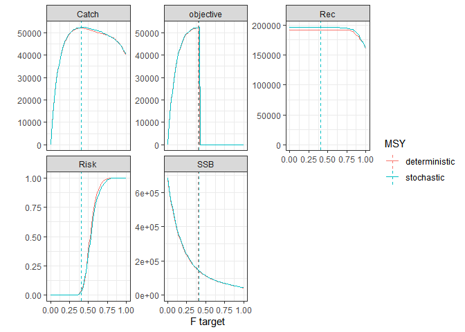
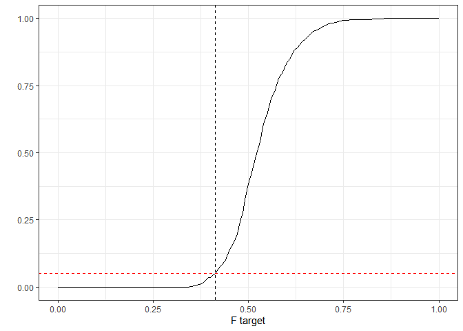

NS cod example - find MSY
================

## Background

This document illustrates finding MSY for NS cod with a stochastic OM.

## Load R packages

``` r
library(doParallel)
library(tidyr)
library(dplyr)
library(FLCore)
library(FLash)
library(ggplotFL)

source("funs.R")
```

## Load OM(s)

Load stochastic and deterministic OMs

``` r
### FLStock
stk <- readRDS("OM_files/cod4/stk.rds")
stk_det <- readRDS("OM_files/cod4/stk_det.rds")
### recruitment model and residuals
sr <- readRDS("OM_files/cod4/sr.rds")
sr_det <- readRDS("OM_files/cod4/sr_det.rds")
sr_res <- readRDS("OM_files/cod4/sr_res.rds")
sr_res_det <- readRDS("OM_files/cod4/sr_res_det.rds")
```

## Stochastic OM

### Explore search space

First, run some F values:

``` r
### define projection
proj_yrs <- 2018:2037 ### years used in projection
Blim <- 107000 ### from ICES WGNSSK 2018 and used by WKNSMSE 2019
risk_limit <- 0.05 ### 5% risk limit
stat_yrs <- 2028:2037 ### years in which catch and risk are calculated (last 10)
### set up environment for storing results
env_stochastic <- new.env()
### this is needed because "optimise" does not store results
### run a few values
fs <- seq(0, 1, 0.1)
. <- foreach(target = fs) %do% {
  proj_stats(stk = stk, sr = sr, sr_res = sr_res, proj_yrs = proj_yrs, 
             target = target,
             Blim = Blim, risk_limit = risk_limit, stat_yrs = stat_yrs,
             trace = TRUE, trace_env = env_stochastic)
}
```

    ##    target       SSB     Catch      Fbar       Rec      Risk objective 
    ##       0.0  684497.1       0.0       0.0  196327.4       0.0       0.0 
    ##    target       SSB     Catch      Fbar       Rec      Risk objective 
    ##      0.10 429938.34  33325.72      0.10 196327.43      0.00  33325.72 
    ##    target       SSB     Catch      Fbar       Rec      Risk objective 
    ##      0.20 287336.34  46590.35      0.20 196327.43      0.00  46590.35 
    ##    target       SSB     Catch      Fbar       Rec      Risk objective 
    ##      0.30 201633.35  51060.31      0.30 196327.43      0.00  51060.31 
    ##     target        SSB      Catch       Fbar        Rec       Risk  objective 
    ##      0.400 148970.566  52296.359      0.400 196327.428      0.028  52296.359 
    ##     target        SSB      Catch       Fbar        Rec       Risk  objective 
    ##      0.500 114685.986  52003.763      0.500 196327.428      0.336     -1.000 
    ##     target        SSB      Catch       Fbar        Rec       Risk  objective 
    ##      0.600  91912.044  51075.829      0.600 196327.428      0.778     -1.000 
    ##     target        SSB      Catch       Fbar        Rec       Risk  objective 
    ##      0.700  76109.397  49740.903      0.700 195526.134      0.942     -1.000 
    ##     target        SSB      Catch       Fbar        Rec       Risk  objective 
    ##      0.800  63967.245  48047.162      0.800 193250.362      0.998     -1.000 
    ##     target        SSB      Catch       Fbar        Rec       Risk  objective 
    ##      0.900  53905.812  45524.662      0.900 184527.646      0.998     -1.000 
    ##    target       SSB     Catch      Fbar       Rec      Risk objective 
    ##      1.00  43527.29  40389.41      1.00 161262.62      1.00     -1.00

``` r
runs_stochastic <- bind_rows(get("res_trace", envir = env_stochastic))
```

We can visualise the results

``` r
runs_stochastic %>%
    pivot_longer(SSB:objective) %>%
    ggplot(aes(x = target, y = value)) +
    facet_wrap(~name, scales = "free_y") +
    geom_line() + geom_point() +
    labs(x = "F target", y = "") +
    geom_blank(data = data.frame(target = 0, value = 0), aes(target, value)) +
    theme_bw()
```

<!-- -->

### Find MSY

The highest catch where Blim risk is \<= 5% is somewhere between F = 0.2
and F = 0.5. We can use `optimise` (a golden section search) to find
MSY:

``` r
### find optimum
MSY_stochastic <- optimise(f = proj_stats, 
                           stk = stk, sr = sr, sr_res = sr_res, 
                           proj_yrs = proj_yrs, Blim = Blim, 
                           risk_limit = risk_limit, stat_yrs = stat_yrs,
                           trace = TRUE, trace_env = env_stochastic,
                           interval = c(0.2, 0.5),
                           lower = 0.2, upper = 0.5,
                           maximum = TRUE,
                           tol = 0.00001)
```

    ##       target          SSB        Catch         Fbar          Rec         Risk 
    ## 3.145898e-01 1.923483e+05 5.145413e+04 3.145898e-01 1.963274e+05 0.000000e+00 
    ##    objective 
    ## 5.145413e+04 
    ##       target          SSB        Catch         Fbar          Rec         Risk 
    ## 3.854102e-01 1.550617e+05 5.214803e+04 3.854102e-01 1.963274e+05 1.400000e-02 
    ##    objective 
    ## 5.214803e+04 
    ##        target           SSB         Catch          Fbar           Rec 
    ##  4.291796e-01  1.376195e+05  5.236375e+04  4.291796e-01  1.963274e+05 
    ##          Risk     objective 
    ##  7.600000e-02 -1.000000e+00 
    ##       target          SSB        Catch         Fbar          Rec         Risk 
    ## 3.504673e-01 1.715158e+05 5.214201e+04 3.504673e-01 1.963274e+05 2.000000e-03 
    ##    objective 
    ## 5.214201e+04 
    ##       target          SSB        Catch         Fbar          Rec         Risk 
    ## 3.682599e-01 1.625689e+05 5.210295e+04 3.682599e-01 1.963274e+05 8.000000e-03 
    ##    objective 
    ## 5.210295e+04 
    ##       target          SSB        Catch         Fbar          Rec         Risk 
    ## 4.021286e-01 1.480330e+05 5.231497e+04 4.021286e-01 1.963274e+05 3.000000e-02 
    ##    objective 
    ## 5.231497e+04 
    ##       target          SSB        Catch         Fbar          Rec         Risk 
    ## 4.124612e-01 1.439328e+05 5.233753e+04 4.124612e-01 1.963274e+05 3.800000e-02 
    ##    objective 
    ## 5.233753e+04 
    ##       target          SSB        Catch         Fbar          Rec         Risk 
    ## 4.110795e-01 1.444828e+05 5.235875e+04 4.110795e-01 1.963274e+05 3.600000e-02 
    ##    objective 
    ## 5.235875e+04 
    ##       target          SSB        Catch         Fbar          Rec         Risk 
    ## 4.078518e-01 1.457747e+05 5.236733e+04 4.078518e-01 1.963274e+05 3.400000e-02 
    ##    objective 
    ## 5.236733e+04 
    ##       target          SSB        Catch         Fbar          Rec         Risk 
    ## 4.056658e-01 1.466306e+05 5.235421e+04 4.056658e-01 1.963274e+05 3.200000e-02 
    ##    objective 
    ## 5.235421e+04 
    ##       target          SSB        Catch         Fbar          Rec         Risk 
    ## 4.086344e-01 1.454639e+05 5.237309e+04 4.086344e-01 1.963274e+05 3.400000e-02 
    ##    objective 
    ## 5.237309e+04 
    ##       target          SSB        Catch         Fbar          Rec         Risk 
    ## 4.091411e-01 1.452597e+05 5.237225e+04 4.091411e-01 1.963274e+05 3.400000e-02 
    ##    objective 
    ## 5.237225e+04 
    ##       target          SSB        Catch         Fbar          Rec         Risk 
    ## 4.087693e-01 1.454095e+05 5.237287e+04 4.087693e-01 1.963274e+05 3.400000e-02 
    ##    objective 
    ## 5.237287e+04 
    ##       target          SSB        Catch         Fbar          Rec         Risk 
    ## 4.083355e-01 1.455845e+05 5.237357e+04 4.083355e-01 1.963274e+05 3.400000e-02 
    ##    objective 
    ## 5.237357e+04 
    ##       target          SSB        Catch         Fbar          Rec         Risk 
    ## 4.081508e-01 1.456583e+05 5.237166e+04 4.081508e-01 1.963274e+05 3.400000e-02 
    ##    objective 
    ## 5.237166e+04 
    ##       target          SSB        Catch         Fbar          Rec         Risk 
    ## 4.084497e-01 1.455384e+05 5.237339e+04 4.084497e-01 1.963274e+05 3.400000e-02 
    ##    objective 
    ## 5.237339e+04 
    ##       target          SSB        Catch         Fbar          Rec         Risk 
    ## 4.082649e-01 1.456130e+05 5.237331e+04 4.082649e-01 1.963274e+05 3.400000e-02 
    ##    objective 
    ## 5.237331e+04 
    ##       target          SSB        Catch         Fbar          Rec         Risk 
    ## 4.083644e-01 1.455728e+05 5.237352e+04 4.083644e-01 1.963274e+05 3.400000e-02 
    ##    objective 
    ## 5.237352e+04 
    ##       target          SSB        Catch         Fbar          Rec         Risk 
    ## 4.083085e-01 1.455954e+05 5.237361e+04 4.083085e-01 1.963274e+05 3.400000e-02 
    ##    objective 
    ## 5.237361e+04 
    ##       target          SSB        Catch         Fbar          Rec         Risk 
    ## 4.082919e-01 1.456021e+05 5.237364e+04 4.082919e-01 1.963274e+05 3.400000e-02 
    ##    objective 
    ## 5.237364e+04 
    ##       target          SSB        Catch         Fbar          Rec         Risk 
    ## 4.082816e-01 1.456063e+05 5.237355e+04 4.082816e-01 1.963274e+05 3.400000e-02 
    ##    objective 
    ## 5.237355e+04 
    ##       target          SSB        Catch         Fbar          Rec         Risk 
    ## 4.082983e-01 1.455996e+05 5.237363e+04 4.082983e-01 1.963274e+05 3.400000e-02 
    ##    objective 
    ## 5.237363e+04 
    ##       target          SSB        Catch         Fbar          Rec         Risk 
    ## 4.082880e-01 1.456037e+05 5.237364e+04 4.082880e-01 1.963274e+05 3.400000e-02 
    ##    objective 
    ## 5.237364e+04 
    ##       target          SSB        Catch         Fbar          Rec         Risk 
    ## 4.082880e-01 1.456037e+05 5.237364e+04 4.082880e-01 1.963274e+05 3.400000e-02 
    ##    objective 
    ## 5.237364e+04

``` r
### Fmsy is
MSY_stochastic$maximum
```

    ## [1] 0.408288

``` r
### extract results
runs_stochastic <- bind_rows(bind_rows(runs_stochastic,
                                       get("res_trace", envir = env_stochastic)))
saveRDS(runs_stochastic, "OM_files/cod4/MSY_runs_stochastic.rds")

### plot
runs_stochastic %>%
    pivot_longer(SSB:objective) %>%
    ggplot(aes(x = target, y = value)) +
    facet_wrap(~name, scales = "free_y") +
    geom_line() +
    geom_vline(xintercept = MSY_stochastic$maximum, linetype = "dashed") + 
    labs(x = "F target", y = "") +
    geom_blank(data = data.frame(target = 0, value = 0), aes(target, value)) +
    theme_bw()
```

<!-- -->

## Do the same for the “deterministic” OM

``` r
env_det <- new.env()
### this is needed because "optimise" does not store results
### run a few values
fs <- seq(0, 1, 0.1)
. <- foreach(target = fs) %do% {
  proj_stats(stk = stk_det, sr = sr_det, sr_res = sr_res_det, 
             proj_yrs = proj_yrs, 
             target = target,
             Blim = Blim, risk_limit = risk_limit, stat_yrs = stat_yrs,
             trace = TRUE, trace_env = env_det)
}
```

    ##    target       SSB     Catch      Fbar       Rec      Risk objective 
    ##       0.0  678240.9       0.0       0.0  192255.9       0.0       0.0 
    ##    target       SSB     Catch      Fbar       Rec      Risk objective 
    ##      0.10 423653.77  33418.59      0.10 192255.86      0.00  33418.59 
    ##    target       SSB     Catch      Fbar       Rec      Risk objective 
    ##      0.20 281691.67  46343.03      0.20 192255.86      0.00  46343.03 
    ##    target       SSB     Catch      Fbar       Rec      Risk objective 
    ##       0.3  197255.0   50890.7       0.3  192255.9       0.0   50890.7 
    ##     target        SSB      Catch       Fbar        Rec       Risk  objective 
    ##      0.400 146007.455  52023.097      0.400 192255.863      0.034  52023.097 
    ##     target        SSB      Catch       Fbar        Rec       Risk  objective 
    ##      0.500 112674.921  51474.914      0.500 192255.863      0.384     -1.000 
    ##    target       SSB     Catch      Fbar       Rec      Risk objective 
    ##      0.60  90469.33  50342.81      0.60 192255.86      0.83     -1.00 
    ##     target        SSB      Catch       Fbar        Rec       Risk  objective 
    ##      0.700  74784.607  49424.519      0.700 192255.863      0.972     -1.000 
    ##     target        SSB      Catch       Fbar        Rec       Risk  objective 
    ##      0.800  63445.738  48185.603      0.800 190320.352      0.996     -1.000 
    ##    target       SSB     Catch      Fbar       Rec      Risk objective 
    ##      0.90  53301.17  45422.37      0.90 181107.23      1.00     -1.00 
    ##    target       SSB     Catch      Fbar       Rec      Risk objective 
    ##      1.00  42082.83  39934.41      1.00 160132.05      1.00     -1.00

``` r
runs_det <- bind_rows(get("res_trace", envir = env_det))
runs_det %>%
    pivot_longer(SSB:objective) %>%
    ggplot(aes(x = target, y = value)) +
    facet_wrap(~name, scales = "free_y") +
    geom_line() + geom_point() +
    labs(x = "F target", y = "") +
    geom_blank(data = data.frame(target = 0, value = 0), aes(target, value)) +
    theme_bw()
```

<!-- -->

``` r
### try F = 0.3, ... 0.5
### find optimum
MSY_det <- optimise(f = proj_stats, 
                    stk = stk_det, sr = sr_det, sr_res = sr_res_det, 
                    proj_yrs = proj_yrs, Blim = Blim, 
                    risk_limit = risk_limit, stat_yrs = stat_yrs,
                    trace = TRUE, trace_env = env_det,
                    interval = c(0.3, 0.5),
                    lower = 0.3, upper = 0.5,
                    maximum = TRUE,
                    tol = 0.00001)
```

    ##       target          SSB        Catch         Fbar          Rec         Risk 
    ## 3.763932e-01 1.560167e+05 5.194120e+04 3.763932e-01 1.922559e+05 1.400000e-02 
    ##    objective 
    ## 5.194120e+04 
    ##        target           SSB         Catch          Fbar           Rec 
    ##  4.236068e-01  1.367705e+05  5.196979e+04  4.236068e-01  1.922559e+05 
    ##          Risk     objective 
    ##  7.600000e-02 -1.000000e+00 
    ##       target          SSB        Catch         Fbar          Rec         Risk 
    ## 3.472136e-01 1.700922e+05 5.175346e+04 3.472136e-01 1.922559e+05 0.000000e+00 
    ##    objective 
    ## 5.175346e+04 
    ##       target          SSB        Catch         Fbar          Rec         Risk 
    ## 3.620255e-01 1.625789e+05 5.187811e+04 3.620255e-01 1.922559e+05 4.000000e-03 
    ##    objective 
    ## 5.187811e+04 
    ##       target          SSB        Catch         Fbar          Rec         Risk 
    ## 3.851221e-01 1.520800e+05 5.196206e+04 3.851221e-01 1.922559e+05 2.000000e-02 
    ##    objective 
    ## 5.196206e+04 
    ##       target          SSB        Catch         Fbar          Rec         Risk 
    ## 3.998220e-01 1.460740e+05 5.202514e+04 3.998220e-01 1.922559e+05 3.400000e-02 
    ##    objective 
    ## 5.202514e+04 
    ##       target          SSB        Catch         Fbar          Rec         Risk 
    ## 4.089070e-01 1.423778e+05 5.201733e+04 4.089070e-01 1.922559e+05 4.800000e-02 
    ##    objective 
    ## 5.201733e+04 
    ##       target          SSB        Catch         Fbar          Rec         Risk 
    ## 4.023798e-01 1.450729e+05 5.202814e+04 4.023798e-01 1.922559e+05 3.400000e-02 
    ##    objective 
    ## 5.202814e+04 
    ##       target          SSB        Catch         Fbar          Rec         Risk 
    ## 4.029842e-01 1.448323e+05 5.203130e+04 4.029842e-01 1.922559e+05 3.600000e-02 
    ##    objective 
    ## 5.203130e+04 
    ##       target          SSB        Catch         Fbar          Rec         Risk 
    ## 4.052465e-01 1.439193e+05 5.203835e+04 4.052465e-01 1.922559e+05 4.000000e-02 
    ##    objective 
    ## 5.203835e+04 
    ##       target          SSB        Catch         Fbar          Rec         Risk 
    ## 4.062486e-01 1.434894e+05 5.203309e+04 4.062486e-01 1.922559e+05 4.000000e-02 
    ##    objective 
    ## 5.203309e+04 
    ##       target          SSB        Catch         Fbar          Rec         Risk 
    ## 4.047233e-01 1.441351e+05 5.204010e+04 4.047233e-01 1.922559e+05 4.000000e-02 
    ##    objective 
    ## 5.204010e+04 
    ##       target          SSB        Catch         Fbar          Rec         Risk 
    ## 4.040590e-01 1.444028e+05 5.203679e+04 4.040590e-01 1.922559e+05 4.000000e-02 
    ##    objective 
    ## 5.203679e+04 
    ##       target          SSB        Catch         Fbar          Rec         Risk 
    ## 4.047468e-01 1.441257e+05 5.204022e+04 4.047468e-01 1.922559e+05 4.000000e-02 
    ##    objective 
    ## 5.204022e+04 
    ##       target          SSB        Catch         Fbar          Rec         Risk 
    ## 4.048842e-01 1.440704e+05 5.204023e+04 4.048842e-01 1.922559e+05 4.000000e-02 
    ##    objective 
    ## 5.204023e+04 
    ##       target          SSB        Catch         Fbar          Rec         Risk 
    ## 4.050226e-01 1.440148e+05 5.203951e+04 4.050226e-01 1.922559e+05 4.000000e-02 
    ##    objective 
    ## 5.203951e+04 
    ##       target          SSB        Catch         Fbar          Rec         Risk 
    ## 4.048166e-01 1.440976e+05 5.204056e+04 4.048166e-01 1.922559e+05 4.000000e-02 
    ##    objective 
    ## 5.204056e+04 
    ##       target          SSB        Catch         Fbar          Rec         Risk 
    ## 4.048132e-01 1.440990e+05 5.204055e+04 4.048132e-01 1.922559e+05 4.000000e-02 
    ##    objective 
    ## 5.204055e+04 
    ##       target          SSB        Catch         Fbar          Rec         Risk 
    ## 4.048326e-01 1.440912e+05 5.204049e+04 4.048326e-01 1.922559e+05 4.000000e-02 
    ##    objective 
    ## 5.204049e+04 
    ##       target          SSB        Catch         Fbar          Rec         Risk 
    ## 4.048227e-01 1.440952e+05 5.204054e+04 4.048227e-01 1.922559e+05 4.000000e-02 
    ##    objective 
    ## 5.204054e+04 
    ##       target          SSB        Catch         Fbar          Rec         Risk 
    ## 4.048166e-01 1.440976e+05 5.204056e+04 4.048166e-01 1.922559e+05 4.000000e-02 
    ##    objective 
    ## 5.204056e+04

``` r
### Fmsy is
MSY_det$maximum
```

    ## [1] 0.4048166

``` r
### extract results
runs_det <- bind_rows(bind_rows(runs_det,
                                       get("res_trace", envir = env_det)))
saveRDS(runs_det, "OM_files/cod4/MSY_runs_det.rds")

### plot
runs_det %>%
    pivot_longer(SSB:objective) %>%
    ggplot(aes(x = target, y = value)) +
    facet_wrap(~name, scales = "free_y") +
    geom_line() +
    geom_vline(xintercept = MSY_det$maximum, linetype = "dashed") + 
    labs(x = "F target", y = "") +
    geom_blank(data = data.frame(target = 0, value = 0), aes(target, value)) +
    theme_bw()
```

<!-- -->

## Compare stochastic and deterministic OM

``` r
bind_rows(runs_det %>% mutate(MSY = "deterministic"),
          runs_stochastic %>% mutate(MSY = "stochastic")) %>%
    pivot_longer(cols = c(SSB, Catch, Rec, Risk, objective)) %>%
    ggplot(aes(x = target, y = value, colour = MSY)) +
    geom_line() +
    facet_wrap(~name, scales = "free_y") +
    geom_vline(data = data.frame(MSY = c("deterministic", "stochastic"),
                                 x = c(MSY_det$maximum, MSY_stochastic$maximum)),
               aes(xintercept = x, colour = MSY), linetype = "dashed") + 
    labs(x = "F target", y = "") +
    geom_blank(data = data.frame(target = 0, value = 0, MSY = NA), 
               aes(target, value)) +
    theme_bw()
```

<!-- -->

## Fp.05

### Explore search space

First, run some F values:

``` r
### set up environment for storing results
env_stochastic_Fp.05 <- new.env()
### this is needed because "optimise" does not store results
### run a few values
fs <- seq(0, 1, 0.1)
. <- foreach(target = fs) %do% {
  proj_stats(stk = stk, sr = sr, sr_res = sr_res, proj_yrs = proj_yrs, 
             target = target, objective = "risk",
             Blim = Blim, risk_limit = risk_limit, stat_yrs = stat_yrs,
             trace = TRUE, trace_env = env_stochastic_Fp.05)
}
```

    ##      target         SSB       Catch        Fbar         Rec        Risk 
    ##      0.0000 684497.0922      0.0000      0.0000 196327.4283      0.0000 
    ##   objective 
    ##     -0.0025 
    ##      target         SSB       Catch        Fbar         Rec        Risk 
    ##      0.1000 429938.3403  33325.7225      0.1000 196327.4283      0.0000 
    ##   objective 
    ##     -0.0025 
    ##      target         SSB       Catch        Fbar         Rec        Risk 
    ##      0.2000 287336.3412  46590.3518      0.2000 196327.4283      0.0000 
    ##   objective 
    ##     -0.0025 
    ##      target         SSB       Catch        Fbar         Rec        Risk 
    ##      0.3000 201633.3492  51060.3099      0.3000 196327.4283      0.0000 
    ##   objective 
    ##     -0.0025 
    ##        target           SSB         Catch          Fbar           Rec 
    ##      0.400000 148970.565669  52296.359500      0.400000 196327.428251 
    ##          Risk     objective 
    ##      0.028000     -0.000484 
    ##        target           SSB         Catch          Fbar           Rec 
    ##      0.500000 114685.985923  52003.763275      0.500000 196327.428251 
    ##          Risk     objective 
    ##      0.336000     -0.081796 
    ##        target           SSB         Catch          Fbar           Rec 
    ##      0.600000  91912.044480  51075.829054      0.600000 196327.428251 
    ##          Risk     objective 
    ##      0.778000     -0.529984 
    ##        target           SSB         Catch          Fbar           Rec 
    ##      0.700000  76109.396813  49740.902755      0.700000 195526.133593 
    ##          Risk     objective 
    ##      0.942000     -0.795664 
    ##        target           SSB         Catch          Fbar           Rec 
    ##      0.800000  63967.244872  48047.162275      0.800000 193250.362469 
    ##          Risk     objective 
    ##      0.998000     -0.898704 
    ##        target           SSB         Catch          Fbar           Rec 
    ##      0.900000  53905.812082  45524.661999      0.900000 184527.645599 
    ##          Risk     objective 
    ##      0.998000     -0.898704 
    ##      target         SSB       Catch        Fbar         Rec        Risk 
    ##      1.0000  43527.2932  40389.4132      1.0000 161262.6201      1.0000 
    ##   objective 
    ##     -0.9025

``` r
runs_stochastic_Fp.05 <- bind_rows(get("res_trace", envir = env_stochastic_Fp.05))
```

We can visualise the results

``` r
runs_stochastic_Fp.05 %>%
    pivot_longer(SSB:objective) %>%
    ggplot(aes(x = target, y = value)) +
    facet_wrap(~name, scales = "free_y") +
    geom_line() + geom_point() +
    labs(x = "F target", y = "") +
    geom_blank(data = data.frame(target = 0, value = 0), aes(target, value)) +
    theme_bw()
```

<!-- -->

### Find Fp.05

New objects and environments

The F where Blim risk is \<= 5% is somewhere between …. We can use
`optimise` (a golden section search) to find Fp.05:

### stochastic

``` r
### find optimum
MSY_stochastic_Fp.05 <- optimise(f = proj_stats, 
                           stk = stk, sr = sr, sr_res = sr_res, 
                           proj_yrs = proj_yrs, Blim = Blim, 
                           objective = "risk",
                           risk_limit = risk_limit, stat_yrs = stat_yrs,
                           trace = TRUE, trace_env = env_stochastic_Fp.05,
                           interval = c(0.3, 0.6),
                           lower = 0.3, upper = 0.6,
                           maximum = TRUE,
                           tol = 0.00001)
```

    ##        target           SSB         Catch          Fbar           Rec 
    ##  4.145898e-01  1.430918e+05  5.233961e+04  4.145898e-01  1.963274e+05 
    ##          Risk     objective 
    ##  4.400000e-02 -3.600000e-05 
    ##        target           SSB         Catch          Fbar           Rec 
    ##  4.854102e-01  1.186848e+05  5.213788e+04  4.854102e-01  1.963274e+05 
    ##          Risk     objective 
    ##  2.720000e-01 -4.928400e-02 
    ##        target           SSB         Catch          Fbar           Rec 
    ##  3.708204e-01  1.614187e+05  5.206585e+04  3.708204e-01  1.963274e+05 
    ##          Risk     objective 
    ##  1.000000e-02 -1.600000e-03 
    ##        target           SSB         Catch          Fbar           Rec 
    ##  3.955053e-01  1.508466e+05  5.223671e+04  3.955053e-01  1.963274e+05 
    ##          Risk     objective 
    ##  2.800000e-02 -4.840000e-04 
    ##        target           SSB         Catch          Fbar           Rec 
    ##  4.286835e-01  1.378075e+05  5.236760e+04  4.286835e-01  1.963274e+05 
    ##          Risk     objective 
    ##  7.600000e-02 -6.760000e-04 
    ##        target           SSB         Catch          Fbar           Rec 
    ##  4.107008e-01  1.446341e+05  5.236513e+04  4.107008e-01  1.963274e+05 
    ##          Risk     objective 
    ##  3.400000e-02 -2.560000e-04 
    ##        target           SSB         Catch          Fbar           Rec 
    ##  4.199731e-01  1.410148e+05  5.237836e+04  4.199731e-01  1.963274e+05 
    ##          Risk     objective 
    ##  4.800000e-02 -4.000000e-06 
    ##        target           SSB         Catch          Fbar           Rec 
    ##  4.178258e-01  1.418276e+05  5.235512e+04  4.178258e-01  1.963274e+05 
    ##          Risk     objective 
    ##  4.400000e-02 -3.600000e-05 
    ##        target           SSB         Catch          Fbar           Rec 
    ##  4.233002e-01  1.397880e+05  5.239894e+04  4.233002e-01  1.963274e+05 
    ##          Risk     objective 
    ##  5.800000e-02 -6.400000e-05 
    ##       target          SSB        Catch         Fbar          Rec         Risk 
    ## 4.212440e-01 1.405441e+05 5.239180e+04 4.212440e-01 1.963274e+05 5.000000e-02 
    ##    objective 
    ## 0.000000e+00 
    ##       target          SSB        Catch         Fbar          Rec         Risk 
    ## 4.210662e-01 1.406098e+05 5.238993e+04 4.210662e-01 1.963274e+05 5.000000e-02 
    ##    objective 
    ## 0.000000e+00 
    ##       target          SSB        Catch         Fbar          Rec         Risk 
    ## 4.211551e-01 1.405770e+05 5.239087e+04 4.211551e-01 1.963274e+05 5.000000e-02 
    ##    objective 
    ## 0.000000e+00 
    ##       target          SSB        Catch         Fbar          Rec         Risk 
    ## 4.211211e-01 1.405895e+05 5.239051e+04 4.211211e-01 1.963274e+05 5.000000e-02 
    ##    objective 
    ## 0.000000e+00 
    ##       target          SSB        Catch         Fbar          Rec         Risk 
    ## 4.211001e-01 1.405973e+05 5.239029e+04 4.211001e-01 1.963274e+05 5.000000e-02 
    ##    objective 
    ## 0.000000e+00 
    ##       target          SSB        Catch         Fbar          Rec         Risk 
    ## 4.210871e-01 1.406021e+05 5.239015e+04 4.210871e-01 1.963274e+05 5.000000e-02 
    ##    objective 
    ## 0.000000e+00 
    ##       target          SSB        Catch         Fbar          Rec         Risk 
    ## 4.210791e-01 1.406050e+05 5.239007e+04 4.210791e-01 1.963274e+05 5.000000e-02 
    ##    objective 
    ## 0.000000e+00 
    ##       target          SSB        Catch         Fbar          Rec         Risk 
    ## 4.210742e-01 1.406069e+05 5.239002e+04 4.210742e-01 1.963274e+05 5.000000e-02 
    ##    objective 
    ## 0.000000e+00 
    ##       target          SSB        Catch         Fbar          Rec         Risk 
    ## 4.210708e-01 1.406081e+05 5.238998e+04 4.210708e-01 1.963274e+05 5.000000e-02 
    ##    objective 
    ## 0.000000e+00 
    ##       target          SSB        Catch         Fbar          Rec         Risk 
    ## 4.210708e-01 1.406081e+05 5.238998e+04 4.210708e-01 1.963274e+05 5.000000e-02 
    ##    objective 
    ## 0.000000e+00

``` r
### Fp.05 is
MSY_stochastic_Fp.05$maximum
```

    ## [1] 0.4210708

``` r
### extract results
runs_stochastic_Fp.05 <- bind_rows(bind_rows(runs_stochastic_Fp.05,
                                       get("res_trace", envir = env_stochastic_Fp.05)))
saveRDS(runs_stochastic_Fp.05, "OM_files/cod4/MSY_runs_stochastic_Fp.05.rds")

### plot
runs_stochastic_Fp.05 %>%
    pivot_longer(SSB:objective) %>%
    ggplot(aes(x = target, y = value)) +
    facet_wrap(~name, scales = "free_y") +
    geom_line() +
    geom_vline(xintercept = MSY_stochastic_Fp.05$maximum, linetype = "dashed") + 
    labs(x = "F target", y = "") +
    geom_blank(data = data.frame(target = 0, value = 0), aes(target, value)) +
    theme_bw()
```

<!-- -->

``` r
runs_stochastic_Fp.05 %>%
    ggplot(aes(x = target, y = Risk)) +
    geom_line() +
    geom_vline(xintercept = MSY_stochastic_Fp.05$maximum, linetype = "dashed") + 
    geom_hline(yintercept = 0.05, linetype = "dashed", colour = "red") +
    labs(x = "F target", y = "") +
    geom_blank(data = data.frame(target = 0, value = 0), aes(target, value)) +
    theme_bw()
```

<!-- -->

### determinstic

Do the same for the deterministic run

``` r
### set up environment for storing results
env_det_Fp.05 <- new.env()
### this is needed because "optimise" does not store results
### run a few values
fs <- seq(0, 1, 0.1)
. <- foreach(target = fs) %do% {
  proj_stats(stk = stk_det, sr = sr_det, sr_res = sr_res_det, proj_yrs = proj_yrs, 
             target = target, objective = "risk",
             Blim = Blim, risk_limit = risk_limit, stat_yrs = stat_yrs,
             trace = TRUE, trace_env = env_det_Fp.05)
}
```

    ##      target         SSB       Catch        Fbar         Rec        Risk 
    ##      0.0000 678240.9237      0.0000      0.0000 192255.8627      0.0000 
    ##   objective 
    ##     -0.0025 
    ##      target         SSB       Catch        Fbar         Rec        Risk 
    ##      0.1000 423653.7695  33418.5863      0.1000 192255.8627      0.0000 
    ##   objective 
    ##     -0.0025 
    ##      target         SSB       Catch        Fbar         Rec        Risk 
    ##      0.2000 281691.6684  46343.0300      0.2000 192255.8627      0.0000 
    ##   objective 
    ##     -0.0025 
    ##      target         SSB       Catch        Fbar         Rec        Risk 
    ##      0.3000 197255.0460  50890.7031      0.3000 192255.8627      0.0000 
    ##   objective 
    ##     -0.0025 
    ##        target           SSB         Catch          Fbar           Rec 
    ##      0.400000 146007.454970  52023.097291      0.400000 192255.862716 
    ##          Risk     objective 
    ##      0.034000     -0.000256 
    ##        target           SSB         Catch          Fbar           Rec 
    ##      0.500000 112674.921170  51474.913883      0.500000 192255.862716 
    ##          Risk     objective 
    ##      0.384000     -0.111556 
    ##      target         SSB       Catch        Fbar         Rec        Risk 
    ##      0.6000  90469.3315  50342.8092      0.6000 192255.8627      0.8300 
    ##   objective 
    ##     -0.6084 
    ##        target           SSB         Catch          Fbar           Rec 
    ##      0.700000  74784.607042  49424.518564      0.700000 192255.862716 
    ##          Risk     objective 
    ##      0.972000     -0.850084 
    ##        target           SSB         Catch          Fbar           Rec 
    ##      0.800000  63445.737632  48185.602568      0.800000 190320.352083 
    ##          Risk     objective 
    ##      0.996000     -0.894916 
    ##      target         SSB       Catch        Fbar         Rec        Risk 
    ##      0.9000  53301.1696  45422.3684      0.9000 181107.2339      1.0000 
    ##   objective 
    ##     -0.9025 
    ##      target         SSB       Catch        Fbar         Rec        Risk 
    ##      1.0000  42082.8296  39934.4124      1.0000 160132.0466      1.0000 
    ##   objective 
    ##     -0.9025

``` r
runs_det_Fp.05 <- bind_rows(get("res_trace", envir = env_det_Fp.05))
```

``` r
### find optimum
MSY_det_Fp.05 <- optimise(f = proj_stats, 
                           stk = stk_det, sr = sr_det, sr_res = sr_res_det, 
                           proj_yrs = proj_yrs, Blim = Blim, 
                           objective = "risk",
                           risk_limit = risk_limit, stat_yrs = stat_yrs,
                           trace = TRUE, trace_env = env_det_Fp.05,
                           interval = c(0.3, 0.6),
                           lower = 0.3, upper = 0.6,
                           maximum = TRUE,
                           tol = 0.00001)
```

    ##        target           SSB         Catch          Fbar           Rec 
    ##  4.145898e-01  1.401678e+05  5.201772e+04  4.145898e-01  1.922559e+05 
    ##          Risk     objective 
    ##  5.200000e-02 -4.000000e-06 
    ##        target           SSB         Catch          Fbar           Rec 
    ##  4.854102e-01  1.167042e+05  5.155819e+04  4.854102e-01  1.922559e+05 
    ##          Risk     objective 
    ##  2.740000e-01 -5.017600e-02 
    ##        target           SSB         Catch          Fbar           Rec 
    ##  3.708204e-01  1.584880e+05  5.192987e+04  3.708204e-01  1.922559e+05 
    ##          Risk     objective 
    ##  1.000000e-02 -1.600000e-03 
    ##        target           SSB         Catch          Fbar           Rec 
    ##  3.955097e-01  1.477933e+05  5.201899e+04  3.955097e-01  1.922559e+05 
    ##          Risk     objective 
    ##  3.400000e-02 -2.560000e-04 
    ##        target           SSB         Catch          Fbar           Rec 
    ##  4.120604e-01  1.411449e+05  5.202340e+04  4.120604e-01  1.922559e+05 
    ##          Risk     objective 
    ##  4.800000e-02 -4.000000e-06 
    ##       target          SSB        Catch         Fbar          Rec         Risk 
    ## 4.133251e-01 1.406551e+05 5.203129e+04 4.133251e-01 1.922559e+05 5.000000e-02 
    ##    objective 
    ## 0.000000e+00 
    ##       target          SSB        Catch         Fbar          Rec         Risk 
    ## 4.133285e-01 1.406538e+05 5.203131e+04 4.133285e-01 1.922559e+05 5.000000e-02 
    ##    objective 
    ## 0.000000e+00 
    ##       target          SSB        Catch         Fbar          Rec         Risk 
    ## 4.133318e-01 1.406525e+05 5.203133e+04 4.133318e-01 1.922559e+05 5.000000e-02 
    ##    objective 
    ## 0.000000e+00 
    ##       target          SSB        Catch         Fbar          Rec         Risk 
    ## 4.138123e-01 1.404671e+05 5.202717e+04 4.138123e-01 1.922559e+05 5.000000e-02 
    ##    objective 
    ## 0.000000e+00 
    ##       target          SSB        Catch         Fbar          Rec         Risk 
    ## 4.141093e-01 1.403527e+05 5.202357e+04 4.141093e-01 1.922559e+05 5.000000e-02 
    ##    objective 
    ## 0.000000e+00 
    ##        target           SSB         Catch          Fbar           Rec 
    ##  4.142928e-01  1.402820e+05  5.202134e+04  4.142928e-01  1.922559e+05 
    ##          Risk     objective 
    ##  5.200000e-02 -4.000000e-06 
    ##       target          SSB        Catch         Fbar          Rec         Risk 
    ## 4.139959e-01 1.403964e+05 5.202494e+04 4.139959e-01 1.922559e+05 5.000000e-02 
    ##    objective 
    ## 0.000000e+00 
    ##       target          SSB        Catch         Fbar          Rec         Risk 
    ## 4.139258e-01 1.404234e+05 5.202580e+04 4.139258e-01 1.922559e+05 5.000000e-02 
    ##    objective 
    ## 0.000000e+00 
    ##       target          SSB        Catch         Fbar          Rec         Risk 
    ## 4.138824e-01 1.404401e+05 5.202632e+04 4.138824e-01 1.922559e+05 5.000000e-02 
    ##    objective 
    ## 0.000000e+00 
    ##       target          SSB        Catch         Fbar          Rec         Risk 
    ## 4.138556e-01 1.404504e+05 5.202665e+04 4.138556e-01 1.922559e+05 5.000000e-02 
    ##    objective 
    ## 0.000000e+00 
    ##       target          SSB        Catch         Fbar          Rec         Risk 
    ## 4.138391e-01 1.404568e+05 5.202685e+04 4.138391e-01 1.922559e+05 5.000000e-02 
    ##    objective 
    ## 0.000000e+00 
    ##       target          SSB        Catch         Fbar          Rec         Risk 
    ## 4.138289e-01 1.404607e+05 5.202697e+04 4.138289e-01 1.922559e+05 5.000000e-02 
    ##    objective 
    ## 0.000000e+00 
    ##       target          SSB        Catch         Fbar          Rec         Risk 
    ## 4.138225e-01 1.404631e+05 5.202705e+04 4.138225e-01 1.922559e+05 5.000000e-02 
    ##    objective 
    ## 0.000000e+00 
    ##       target          SSB        Catch         Fbar          Rec         Risk 
    ## 4.138186e-01 1.404647e+05 5.202709e+04 4.138186e-01 1.922559e+05 5.000000e-02 
    ##    objective 
    ## 0.000000e+00 
    ##       target          SSB        Catch         Fbar          Rec         Risk 
    ## 4.138186e-01 1.404647e+05 5.202709e+04 4.138186e-01 1.922559e+05 5.000000e-02 
    ##    objective 
    ## 0.000000e+00

``` r
### Fp.05 is
MSY_det_Fp.05$maximum
```

    ## [1] 0.4138186

``` r
### extract results
runs_det_Fp.05 <- bind_rows(bind_rows(runs_det_Fp.05,
                                       get("res_trace", envir = env_det_Fp.05)))
saveRDS(runs_det_Fp.05, "OM_files/cod4/MSY_runs_det_Fp.05.rds")

### plot
runs_det_Fp.05 %>%
    pivot_longer(SSB:objective) %>%
    ggplot(aes(x = target, y = value)) +
    facet_wrap(~name, scales = "free_y") +
    geom_line() +
    geom_vline(xintercept = MSY_det_Fp.05$maximum, linetype = "dashed") + 
    labs(x = "F target", y = "") +
    geom_blank(data = data.frame(target = 0, value = 0), aes(target, value)) +
    theme_bw()
```

<!-- -->

``` r
runs_det_Fp.05 %>%
    ggplot(aes(x = target, y = Risk)) +
    geom_line() +
    geom_vline(xintercept = MSY_det_Fp.05$maximum, linetype = "dashed") + 
    geom_hline(yintercept = 0.05, linetype = "dashed", colour = "red") +
    labs(x = "F target", y = "") +
    geom_blank(data = data.frame(target = 0, value = 0), aes(target, value)) +
    theme_bw()
```

<!-- -->
